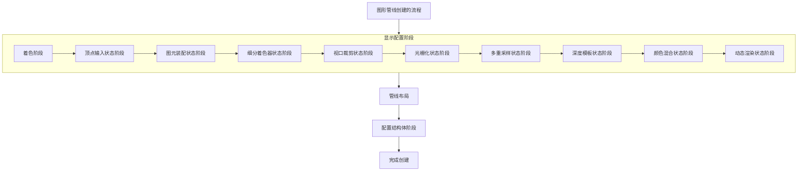

## Vulkan图形管线的创建流程（The process of Vulkan GraphicsPipeline）

回顾一下，在上一节中我们成功创建了Vulkan图像视图，完成这个Vulkan初始化配置对于绘制的图片输出到显示器桌面意义重大。下面的章节中，将会深入探讨Vulkan图形管线的创建流程，这一步操作的意义非常重大，一个完整的Vulkan项目管线是必须的配置，创建一个配置合理的管线对于后续数据流的处理十分重要。接下来，我们就走进Vulkan的图形管线的创建流程，去揭开它的层层面纱。

---

### 图形管线创建流程
#### 1.创建头文件契约

##### 第一步：创建私有属性契约

老规矩在创建Vulkan设备之前，首先都要去头文件中声明章节相关内容的属性用于后续的保存和使用。这里我们在头文件私有属性中声明两个关于Vulkan管线的属性签名，同时还需要在头文件私有方法区声明一个函数签名作为创建图形管线的核心方法在内部定义实现内容。具体的属性签名如下展示：

**HelloTriangleApplication.h**

```cpp
class HelloTriangleApplication
{
private:
    GLFWwindow*                        window          = nullptr;     //窗口属性
    vk::raii::Context                  context;                       //Vulkan上下文
    vk::raii::Instance                 instance        = nullptr;     //Vulkan实例
    vk::raii::DebugUtilsMessengerEXT   debugMessager   = nullptr;     //Vulkan验证层
    vk::raii::PhysicalDevice           physicalDevice  = nullptr;     //物理设备
    vk::raii::Device                   device          = nullptr;     //逻辑设备
    uint32_t                           queueIndex      = ~0;
    vk::raii::Queue                    graphicsQueue   = nullptr;     //图形队列
    vk::raii::SurfaceKHR               surface         = nullptr;     //Vulkan 渲染界面
    vk::raii::SwapchainKHR             swapChain       = nullptr;     //Vulkan 交换链
    vk::SurfaceFormatKHR               swapChainSurfaceFormat;        //渲染界面的格式
    vk::Extent2D                       swapChainExtent;               //交换链的大小
    std::vector<vk::raii::ImageView>   swapChainImageView;            //图像的视图

    vk::raii::PipelineLayout           pipelineLayout   = nullptr;    //图形管线布局（新添加）
    vk::raii::pipeline                 graphicsPipeline = nullptr;    //图形管线实例对象（新添加）
}
```

就如上面的代码所展示的内容一样，创建了两个图形管线相关的属性实例对象：
- `vk::raii::PipelineLayout`：这个属性是关于Vulkan管线布局的内容，
- `vk::raii::Pipeline`：这是Vulkan管线类的Vulkan-hpp封装版本，主要用于创建和保存管线的相关内容，便于后续使用。


##### 第二步：创建私有函数方法

**HelloTriangleApplication.h**

```cpp
class HelloTriangleApplication
{
private:
    void initVulkan();
    void mainLoop();
    void cleanUp();
    void initWindow();
    void CreateInstance();
    
    void setupDebugMessager();
    static VKAPI_ATTP vk::Bool32 VKAPI_CALL debugCallback(
        vk::DebugUtilsMessageSeverityFlagsEXT severity,
        vk::DebugUtilsMessageTypeFlagBitsEXT type,
        const vk::DebugUtilsMessengerCallbackDataEXT* CallbackData,
        void*);

    std::vector<const char*> getRequiredExtensions();
    void pickPhysicalDevice();
    void CreateLogicalDevice();
    void CreateSurface();

    void CreateSwapChain();
    static uint32_t chooseSwapMinImageCount(const vk::SurfaceCapabilitiesKHR& surfaceCapabilities);//选择交换图像的最小数量
    static vk::SurfaceFormatKHR chooseSwapSurfaceFormat(const std::vector<vk::SurfaceFormatKHR>& availableFormats);//选择交换界面的格式
    static vk::PresentModeKHR chooseSwapPresentMode(const std::vector<vk::PresentModeKHR>& availablePresentModes);//选择交换的功能
    vk::Extent2D chooseSwapExtent(const vk::SurfaceCapabilitiesKHR& capabilities);//选择交换的区域范围

    void CreateImageView(); //创建交换链图像的输出格式

    void CreateGraphicsPipeline(); //创建图形管线（新添加）
    [[nodiscard]] vk::raii::ShaderModule CreateShaderModule(const std::vector<char>& code) const; //创建着色器小程序（新添加）
    static std::readFile(const std::string& filename); //读取着色器源代码
}
```

在上面的代码中，我们创建了三个私有函数方法，它们构成了一个完整的Vulkan图形管线创建的流程中需要包含的内容。
- `CreeateGraphicsPipeline()`：这个函数是创建Vulkan图形管线的核心方法，需要在该函数内部显示指定创建管线所需的所有属性内容。
- `CreateShaderModule()`：创建着色器模块的函数方法，Vulkan使用的是字节码类型的SPIR-V着色器，意味着传统的着色器语言：GLSL、HLSL、Slang需要通过官方提供的SPIR-V编译器编译为Vulkan支持的字节码类型的语言。
- `readFile()`：用于读取编译后的SPIR-V类型的着色器源代码。

---

#### 2.创建着色器模块
##### 第一步：了解Vulkan着色器结构体属性

在创建着色器模块前，我们依然需要先去了解着色器模块的结构体内部都有哪些属性，只有当我们对其内部的属性足够了解之后，我们才会构建出更好的图形管线。它的具体属性如下展示：

**vk::ShaderModuleCreateInfo**

```cpp
struct ShaderModuleCreateInfo
{
    static const bool allowDuplicate = false;
    static StructureType structure = StructureType::eShaderModuleCreateInfo;

    vk::ShaderModuleCreateFlags flags_    = {};
    size_t                      codeSize_ = {};
    const uint32_t*             pCode     = {};
    const void*                 pNext     = {};
}
```

上面就是着色器模块结构体的内部属性，前两个我们不再过多讲解，毕竟之前已经讲解过很多遍了。直接讲解后面几个属性：
- `flags_`：着色器程序的创建标志，目前 Vulkan 规范中没有定义任何可用的标志，一般设置为 0 或空。
- `codeSize_`：指定要加载的 SPIR-V 二进制代码的总字节数。它必须是 4 字节的整数倍，因为 SPIR-V 是以 32 位字为单位存储的。
- `pCode`：指向 SPIR-V 二进制代码数据的指针。这是编译后的着色器程序，由 glslc、hlslc、slangc 等工具生成，Vulkan 驱动会加载并解析这段二进制数据来创建着色器模块。
- `pNext`：指向扩展结构的指针，用于传递 Vulkan 扩展所需的额外数据。如果没有使用任何扩展，这个参数就设置为 `nullptr`。


##### 第二步：显示配置着色器结构体

讲解完着色器模块结构体后，如果你具有一定的图形学基础，你就会发现图形管线是一个环环相扣的管道，也就是说数据会像流水线产品一样被处理，这里我们要创建的着色器模块正是图形管线最为重要的一部分。下面就是展示如何出创建着色器模块的通用函数方法：

**HelloTriangleApplication.cpp**

```cpp
[[nodiscard]] vk::raii::ShaderModule HelloTriangleApplication::CreateShaderModule(const std::vector<char>& code) const{
    vk::ShaderMoudleCreateInfo createInfo = {
        createInfo.flags = {},
        createInfo.codeSize = code.size() * sizeof(char),
        createInfo.pCode = reinterpret_cast<const uint32_t*>(code.data()),
        createInfo.pNext = nullptr
    };

    vk::raii::ShaderModule shaderModule(device, createInfo);

    return shaderModule;
}
```

在上面的代码中我们需要注意的点仅仅有两点，结合场景来具体分析一下：
- `codeSize`：首先是这个属性的显示配置内容，这里我们用`code.size() * sizeof(char)`来获取整个`code`变量全部的字节大小
- `pCode`：这个属性需要的是将`char*`类型指针转换为`uint32_t*`类型的指针，我们这里使用`reinterpret_cast<>`类型强制转换，把数据类型之间毫无逻辑关系进行内存重解释。
- `shaderModule(device, createInfo)`：这里创建着色器实例对象，并把它与之前的逻辑设备绑定。

---

#### 3.读取着色器文件源代码

在上面创建完Vulkan着色器后，还需要读取SPIR-V着色器文件从中解析源代码供后续图形管道使用。这里将会讲解如何在之前创建的私有函数方法中定义实现具体的内容。

**HelloTriangleApplication.cpp**

```cpp
std::vector<char> HelloTriangleApplication::readFile(const std::string& filename) 
{
    std::ifstream ifs(filename, std::ios::ate | std::ios::binary);
    if(!ifs.is_open()) {
        throw std::runtime_error("Failed to open file");
    }

    std::vector<char> buffer(file.tellg());
    file.seekg(0, std::ios::beg);
    file.read(buffer.data(), static_cast<std::streamsize>(buffer.size()));
    file.close();

    return buffer;
}
```

我们来具体解释一下这段代码的含义：
- `ifs(filename, std::ios::ate | std::ios::binary)`：打开文件只能读取无法进行修改，同时打开时直接到达文件末尾，读取时使用二进制的方式读取着色器源代码文件。
- `std::vector<char> buffer(file.tellg())`：获取当前文件指针的位置，因为我们用了 `std::ios::ate`，所以这个值就是文件的总字节数。
- `file.seekg(0, std::ios::beg)`：将文件指针从末尾移回文件开头（`beg` = begin），准备开始读取。
- `file.read(...)`：将文件内容读入 `buffer`。`buffer.data()` 返回指向缓冲区的指针，`buffer.size()` 是要读取的字节数。这里用 `static_cast` 把 `size_t` 转成 `std::streamsize`，是为了匹配 `read` 函数的参数类型。
- `file。close()`：关闭文件流。

---

#### 4.创建着色器
##### 第一步：从着色器源代码创建着色器实例对象

当上面两个用于创建着色器的辅助函数实现后，接下来就可以正式开始定义实现图形管线的函数方法的内容了，但是图形管线创建是复杂的，不管是从顶点输入->顶点着色器->光栅化->片段着色器->帧缓冲的传统管线，还是从顶点输入->任务着色器->网格着色器->帧缓冲的现代管线，Vulkan对于图形管线的要求都是显示并且十分严格的，但凡中间有步骤错误，最后输出的图形都会失败。下面我们将深入探讨Vulkan图形管线的创建。

**HelloTriangleApplication.cpp**

```cpp
void HelloTriangleApplication::CreateGraphicsPipeline()
{
    //读取着色器文件源代码
    vertexShader = CreateShaderModule(readFile(filepath));
    fragmentShader = CreateShaderModule(readFile(filepath));
}
```

- `vertexShader`：从你的着色器源文件路径读取着色器源代码，这是顶点着色器的实例对象。
- `fragmentShader`：从着色器源文件路径读取着色器源代码，这里创建的片段着色器实例对象。

---

##### 第二步：了解顶点、片段着色器结构体属性

首先对于Vulkan的图形管线的搭建，都是先创建顶点着色器和片段着色器
虽然一个完整的管线还需要曲面细分着色器、几何着色器以及后效果处理与顶点、片段着色器结合程一个完整的图形管线，但是这三个在需要构建复杂的图形管线时才会使用它们，顶点着色器和片段着色器的结合已经可以胜任简单的图形绘制任务。下面我们就将对顶点和片段着色器的结构体属性具体分析。

###### 顶点着色器

**vk::PipelineShaderStageCreateInfo**

```cpp
struct PipelineShaderStageCreateInfo
{
    static const bool allowDuplicate = false;
    static StructureType structure = StructureType::ePipelineShaderStageCreateInfo;

    vk::PipelineShaderStageCreateFlags flags_  = {};
    vk::ShaderStageFlagBits            stage_  = {};
    vk::ShaderModule                   module_ = {};
    const char*                        pName   = {};
    const SpecializationInfo*          pSpecializationInfo_ = {};
    const void*                        pNext   = {};
}
```

老规矩，前面两个属性我们不多说，直接解释后面的属性含义：
- `flags_`：着色器阶段的创建标志，目前 Vulkan 规范中没有定义任何可用的标志，所以这个参数通常设置为 0 或空。
- `stage_`：指定这个配置对应的是哪个着色器阶段，例如：
  - ###### 传统管线
    - `vk::ShaderStageFlagBits::eVertex`：顶点着色器
    - `vk::ShaderStageFlagBits::eFragment`：片段着色器
    - `vk::ShaderStageFlagBits::eCompute`：计算着色器
    - `vk::ShaderStageFlagBits::eTessellationContral`：细分控制着色器
    - `vk::ShaderStageFlagBits::eTessellationEvaluation`：细分评估着色器
    - `vk::ShaderStageFlagBits::eGeometry`：几何着色器
  - ###### 现代管线
    - `vk::ShaderStageFlagBits::eTaskEXT`：任务着色器
    - `vk::ShaderStageFlagBits::eMeshEXT`：网格着色器
  - ###### 光线追踪
    - `vk::ShaderStageFlagBits::eRaygenKHR`：
  光线生成着色器，这是光线追踪的 “入口点”，负责在 GPU 上生成初始的光线（比如从相机位置发射出的视线方向光线），并协调整个追踪过程。
    - `vk::ShaderStageFlagBits::eAnyHitKHR`：
  任意命中着色器，当光线与场景中的任意物体相交时就会触发，通常用于实现早期终止（比如判断透明物体时直接返回），或者记录相交信息。
    - `vk::ShaderStageFlagBits::eCallableKHR`：
  可调用着色器，这是一个 “通用工具函数” 性质的着色器，可以被其他光线追踪着色器（如 Raygen、ClosestHit、Miss）调用，用于实现可复用的计算逻辑（比如阴影光线追踪）
    - `vk::ShaderStageFlagBits::eClosestHitKHR`：
  最近命中着色，当光线找到与场景的 “最近交点” 时触发，是实现材质着色、光照计算的核心阶段，也是你定义物体表面视觉效果的地方。
    - `vk::ShaderStageFlagBits::eIntersectionKHR`：
  相交着色器，用于自定义光线与物体的相交检测逻辑，主要用来处理复杂的几何体（比如细分曲面、隐式曲面），可以替代 Vulkan 默认的三角形相交检测。
    - `vk::ShaderStageFlagBits::eMissKHR`：
  未命中着色器，当光线没有与场景中的任何物体相交时触发，通常用来返回背景颜色（比如天空盒）或环境光，保证光线追踪的完整性。
  - ###### 华为专属
    - `vk::ShaderStageFlagBits::eClusterCullingHUAWEI`：
  集群剔除着色器，将场景中的几何图元（三角形、顶点组）按空间区域划分为多个 “集群（Cluster）”，在渲染前通过该着色器阶段批量检测集群是否在相机视锥内、是否被遮挡，对不可见的集群直接剔除，不进入后续的顶点着色、光栅化等阶段。
    - `vk::ShaderStageFlagBits::eClusterCullingHUAWEI`：
  子通道着色器，在单个子通道内部，插入专属的着色器阶段，实现子通道级别的精细化着色计算，让子通道的渲染任务更灵活，同时利用华为 GPU 的子通道资源共享优化，减少着色器执行过程中的内存访问开销。
- `module_`：指向已经创建好的着色器模块对象（就是你之前用 CreateShaderModule 创建的那个）。这个模块包含了编译后的 SPIR-V 二进制代码。
- `pName_`：指定要在着色器模块中使用的入口点函数名称。在 GLSL 中，默认的入口点是 `main`，所以这里通常填 "main"。
- `pSpecializationInfo_`：指向一个 `SpecializationInfo` 结构体，用于在创建着色器阶段时动态设置常量值。这是一个高级特性，可以在不重新编译 SPIR-V 的情况下，修改着色器中的某些常量，常用于需要同一套着色器适配不同参数的场景。不需要就设为nullptr。
- `pNext_`：指向扩展结构的指针，用于传递 Vulkan 扩展所需的额外数据。如果没有使用任何扩展，这个参数就设置为 nullptr。

---

##### 第三步：配置着色器结构体

上面我们已经深入了解了着色器结构体每一个属性的具体含义，这会让接下来的工作好做很多，那么下面就让我们来显示配置顶点和片段着色器的结构体吧，具体配置如下展示：

**HelloTriangleApplcation.cpp**

```cpp
void HelloTriangleApplcation::CreateGraphicsPipeline()

{
    //上面代码保持不变

    //创建顶点着色器
    vk::PipelineShaderStageCreateInfo vertShaderStageInfo = {
        vertShaderStageInfo.flags = {},
        vertShaderStageInfo.stage = vk::ShaderStageFlagBits::eVertex,
        vertShaderStageInfo.module = vertexShader,
        vertShaderStageInfo.pName = "main",
        vertShaderStageInfo.pSpecializationInfo = nullptr,
        vertShaderStageInfo.pNext = nullptr
    };

    //创建片段着色器
    vk::PipelineShaderStageCreateInfo fragShaderStageInfo = {
        fragShaderStageInfo.flags = {},
        fragShaderStageInfo.stage = vk::ShaderStageFlagBits::eFragment,
        fragShaderStageInfo.module = fragmentShader,
        fragShaderStageInfo.pName = "main",
        fragShaderStageInfo.pSpecializationInfo = nullptr,
        fragShaderStageInfo.pNext = nullptr
    };

    vk::PipelineShaderStageCreateInfo shaderStages[] = {
        vertShaderStageInfo,
        fragShaderStageInfo
    };
}
```

在上面的代码中，分别创建了顶点着色器和片段着色器的实例对象，除了`stage`和`module`这两个属性两者存在差异外，其余的属性配置完全一样。
- `shaderStage[] = { vertShaderStageInfo, fragShaderStageInfo }`：用来存储着色器类型的数组，此处创建便于后续使用。

---

##### 第四步：创建管道顶点输入状态信息

上一步中我们成功创建了着色器对象，下面我们将沿着之前的思路，创建管道顶点输入的状态信息。但是先要做的事情是了解相关结构体的内部属性的含义，具体的属性如下：

**HelloTriangleApplcation.cpp**

```cpp
struct PipelineVertexInputStateCreateInfo
{
    static const bool allowDuplicate = false;
    static StructureType structure = StructureType::ePipelineVertexInputStateCreateInfo;

    vk::PipelineVertexInputStateCreateFlags flags_ = {};
    uint32_t vertexBindingDescriptionCount_ = {};
    const VertexInputBindingDescription* pVertexBindingDescriptions_ = {};
    uint32_t vertexAttributeDescriptionCount_ = {};
    const VertexInputAttributeDescription* pVertexAttributeDescriptions_ = {};
    const void* pNext_ = nullptr;
}
```

这个结构体是 Vulkan 中的 `VkPipelineVertexInputStateCreateInfo` 的 C++ 封装，它的作用是**定义渲染管线如何从内存中读取顶点数据**，是构建图形渲染管线的关键配置之一。下面将解释其中属性的含义：

- `flags_`：顶点输入状态的创建标志，目前 Vulkan 规范中没有定义任何可用的标志，所以这个参数通常设置为 0 或空。
- `vertexBindingDescriptionCount_`：指定 `pVertexBindingDescriptions_`数组中包含的顶点绑定描述的数量。
- `pVertexBindingDescriptions_`：指向 `VertexInputBindingDescription` 结构体数组的指针,每个元素描述了一个顶点数据缓冲区的内存布局，比如：
  - `binding`：该绑定的编号，用于和属性描述关联。
  - `stride`：两个连续顶点数据之间的字节偏移量（步长）。
  - `inputRate`：数据的输入速率，是按顶点（`VK_VERTEX_INPUT_RATE_VERTEX`）还是按实例（`VK_VERTEX_INPUT_RATE_INSTANCE`）提供。
- `vertexAttributeDescriptionCount_`：指定 `pVertexAttributeDescriptions_` 数组中包含的顶点属性描述的数量。
- `pVertexAttributeDescriptions_`：指向 `VertexInputAttributeDescription` 结构体数组的指针，每个元素描述了一个顶点属性的提取方式，比如：
  - `location`：该属性在顶点着色器中的输入位置（对应 `layout(location = X)`）
  - `binding`：该属性从哪个绑定描述中读取数据。
  - `format`：该属性的数据格式（比如 `VK_FORMAT_R32G32B32_SFLOAT` 表示三维浮点数）
  - `offset`：该属性在绑定数据中的字节偏移量。
- `pNext_`：指向扩展结构的指针，用于传递 Vulkan 扩展所需的额外数据。如果没有使用任何扩展，这个参数就设置为 `nullptr`。

**HelloTriangleApplcation.cpp**

```cpp
void HelloTriangleApplcation::CreateGraphicsPipeline()
{
    //上面代码保持不变

    vk::PipelineVertexInputStateCreateInfo vertexInputInfo = {
        vertexInputInfo.flags = {},
        vertexInputInfo.vertexBindingDescriptionCount = 0,
        vertexInputInfo.pVertexBindingDescriptions = nullptr,
        vertexInputInfo.vertexAttributeDescriptionCount = 0,
        vertexInputInfo.pVertexAttributeDescriptions = nullptr,
        vertexInputInfo.pNext = nullptr
    };
}
```

上面这段代码就是我们对于这个结构体的属性配置，目前这个结构体没有任何属性配置，毕竟当前阶段在GLSL中创建的着色器源码包含了顶点的属性信息，当如果我们把顶点数据创建在CPU端时，就必需要显示配置这个结构体了。

---

##### 第五步：创建管道输入图元状态信息

这一步是负责创建管道输入顶点的基本图元构成状态，基本图元的类型有线条、三角形、四边形等。几乎大部分的图形都是由这些基本图形绘制组合而成的，所以创建合适的基本图元对于Vulkan程序来说是必要的。下面首先来了解管道图元状态的结构体内容有哪些再说吧，具体内容如下展示：

**vk::PipelineInputAssemblyStateCreateInfo**

```cpp
struct PipelineInputAssemblyStateCreateInfo
{
  static const bool allowDuplicate = false;
  static StructureType structure = StructureType::ePipelineInputAssemblyStateCreateInfo;

  vk::PipelineInputAssemblyStateCreateFlags flags_ = {};
  vk::PrimitiveTopology                     topology_ = {};
  vk::Bool32                           primitiveRestartEnable_ = {};
  const void*                               pNext_ = {};
}
```

上面这一段代码，前两个属性我们直接跳过，重点关注后续的属性：
- `flags_`：这是标志位集合，目前 Vulkan 规范里这个字段没有定义任何可用的标志，所以通常直接初始化为空即可。
- `topology_`：这是最核心的配置之一，用来指定顶点数据要被装配成什么样的图元拓扑，比如：
  - `eTrianglelist`：顶点按顺序组成独立的三角形
  - `eLineStrip`：顶点按顺序组成连续的折线
  - `ePointlist`：每个顶点作为一个独立的点
- `primitiveRestartEnable_`：这个开关用于启用 “图元重启” 功能。当启用时（设为 `VK_TRUE`），你可以在索引缓冲区中使用特殊的索引值（比如 `0xFFFF` 或 `0xFFFFFFFF`）来打断当前的图元序列，开始一个新的图元。
- `pNext`：这是一个指向扩展数据的指针，用于向后兼容和扩展。如果你需要使用 Vulkan 的某些扩展特性，可以通过这个指针传递额外的结构体数据。如果没有扩展需求，直接初始化为 `nullptr` 即可。

**HelloTriangleApplcation.cpp**

```cpp
void HelloTriangleApplcation::CreateGraphicsPipeline()
{
  //上面代码保持不变

  vk::PipelineInputAssemblyStateCreateInfo inputAssembly = {
    inputAssembly.flags = {},
    inputAssembly.topology = vk::PrimitiveTopology::eTriangleList,
    inputAssembly.primitiveRestartEnable = VK_FALSE,
    inputAssembly.pNext = nullptr
  };
}
```

上面这段代码就是我们对于图元状态结构体的显示配置，这里会将顶点连接成三角形在构成一个几何图形，同时关闭了图元的**图元重启**功能。

---

##### 第六步：创建管道视口状态信息

这一步是创建管道视口状态信息的结构体，这个结构体是 Vulkan 管线创建中视口与裁剪矩形的核心配置载体，专门用于告知 Vulkan 驱动：渲染时顶点坐标如何从**裁剪空间转换到窗口 / 帧缓冲区的像素空间**，以及最终哪些像素区域会被实际渲染（超出区域直接丢弃）。简单来说，它决定了渲染结果在屏幕 / 帧缓冲区中的显示位置、尺寸范围和有效绘制区域，是连接 3D 坐标和 2D 像素显示的关键配置环节。

**vk::PipelineViewportStateCreateInfo**

```cpp
struct PipelineViewportStateCreateInfo
{
  static const bool allowDuplicate = false;
  static StructureType structure = StructureType::ePipelineViewportStateCreateInfo;

  vk::PipelineViewportStateCreateFlags flags_         = {};
  uint32_t                             viewportCount_ = {};
  const Viewport*                      pViewports_    = {};
  uint32_t                             scissorCount_  = {};
  const Rect2D*                        pScissors_     = {};
  const void*                          pNext_ = nullptr;
}
```

- `flags_`：标志位集合，目前 Vulkan 规范里这个字段没有定义任何可用的标志，所以通常直接初始化为空。
- `viewportCount_`：表示你要设置的视口（Viewport）数量。Vulkan 支持多个视口并行渲染，这个值要和下面 `pViewports_` 指向的数组长度一致。
- `pViewports_`：指向一个 `Viewport` 结构体数组的指针。每个 Viewport 定义了一个矩形区域，用来把顶点坐标从裁剪空间转换到窗口坐标，决定了渲染结果在屏幕上的位置和缩放。
- `scissorCount_`：表示你要设置的裁剪矩形（Scissor）数量。裁剪矩形的数量通常和视口数量保持一致，这个值要和下面 `pScissors_` 指向的数组长度一致。
- `pScissors_`：指向一个 `Rect2D` 结构体数组的指针。每个裁剪矩形定义了一个区域，只有在这个区域内的像素才会被渲染出来，超出的部分会被丢弃，这可以用来限制渲染的范围。
- `pNext_`：扩展指针，和之前一样，用来传递 Vulkan 扩展所需的额外数据。如果没有使用扩展，保持为 `nullptr` 即可。

**HelloTriangleApplication.cpp**

```cpp
void HelloTriangleApplcation::CreateGraphicsPipeline()
{
  //上面代码保持不变

  vk::PipelineViewportStateCreateInfo viewportState = {
    viewportState.flags = {};
    viewportState.viewportCount = 1;
    viewportState.pViewports = nullptr;
    viewportState.scissorCount = 1;
    viewportState.pScissors = nullptr;
    viewportState.pNext = nullptr;
  };
}
```

由于该项目至始至终都只使用一个视口进行渲染，所以我们把视口和裁剪空间的数量都设置为1，代表着只使用一个视口空间和裁剪空间，对于后面绑定在视口结构体和裁剪空间区域数组的指针在这里设置为`nullptr`就可以了。

---

##### 第七步：创建管道栅格化状态信息

该结构体是Vulkan 图形管线创建的核心配置组件，专门用于定义和配置渲染管线中「光栅化阶段（Rasterization Stage）」的所有行为规则，是创建 Vulkan 图形管线时必须指定的关键状态之一。简单说：光栅化阶段是将顶点着色器输出的几何图元（点、线、三角形） 转换为屏幕上离散片元（像素候选） 的核心阶段，而这个结构体就是开发者向 Vulkan 驱动传递 “如何执行光栅化” 的所有指令，驱动会严格按照该结构体的配置完成光栅化计算，最终影响画面的渲染形态、剔除规则、深度处理等核心视觉和性能表现。

**vk::PipelineRasterizationStateCreateInfo**

```cpp
struct PipelineRasterizationStateCreateInfo
{
  static const bool allowDuplicate = false;
  static StructureType structureType = StructureType::ePipelineRasterizationStateCreateInfo;

  vk::PipelineRasterizationStateCreateFlags flags_ = {};
  vk::Bool32 depthClampEnable_ = {};
  vk::Bool32 rasterizerDiscardEnable_ = {};
  vk::PolygonMode polygonMode_ = vk::PolygonMode::eFill;
  vk::CullModeFlags cullMode_ = {};
  vk::FrontFace frontFace_ = vk::FrontFace::eCounterClockwise;
  vk::Bool32 depthBiasEnable_ = {};
  float depthBiasConstantFactor_ = {};
  float depthBiasClamp_ = {};
  float depthBiasSlopeFactor_ = {};
  float lineWidth_ = {};
  const void* pNext_ = nullptr;
}
```

上面这段代码中每个属性的具体含义作用如下：

- `flags_`：标志位集合，目前 Vulkan 规范里这个字段没有定义任何可用的标志，所以通常直接初始化为空即可。
- `depthClampEnable_`：启用深度钳制。如果设为 `VK_TRUE`，光栅化后的像素深度值会被钳制在 `[0,1]`范围内，而不是被裁剪掉。这在需要渲染超出近 / 远裁剪面但又不想被裁剪的物体时非常有用（比如地形渲染）。
- `rasterizerDiscardEnable_`：启用光栅化丢弃。如果设为 `VK_TRUE`，光栅化阶段会被完全跳过，图元不会生成任何片元，这在只需要顶点着色器输出（比如计算位置信息）而不需要渲染像素时使用。
- `polygonMode_`：多边形的光栅化模式，决定了图元被渲染成什么样子：
  - `eFill`：这是默认选项，填充多边形内部。
  - `eLine`：只渲染多边形的边缘，显示为线框。
  - `ePoint`：只渲染多边形的顶点，显示为点。
  注意：线框和点模式需要设备支持，并且通常需要开启特定的特性才能使用。
- `cullMode_`：面剔除模式，决定哪些面会被光栅化阶段剔除（不生成片元）
  - `eNone`：不剔除任何面。
  - `eFront`：剔除正面。
  - `eBack`：剔除背面。
  - `eFrontAndBack`：剔除正面和背面。
- `frontFace_`：正面朝向的定义，用来配合面剔除模式工作：
  - `eClockwise`：顶点按顺时针顺序排列的面为正面。
  - `eCounterClockwise`：顶点按逆时针顺序排列的面为正面。
- `depthBiasEnable_`：启用深度偏移。如果设为 `VK_TRUE`，光栅化阶段会为片元的深度值添加一个偏移量，用于避免阴影贴图中的 “阴影失真”（Shadow Acne）或解决物体表面的 Z-fighting 问题。
- `depthBiasConstantFactor_`：深度偏移的常数因子，是深度偏移公式的一部分。
- `depthBiasClamp_`：深度偏移的最大值，用来限制深度偏移的范围，防止偏移量过大导致的视觉问题。如果设为 0，则表示没有限制。
- `depthBiasSlopeFactor_`：深度偏移的斜率因子，与片元的斜率（表面的陡峭程度）相乘，是深度偏移公式的另一部分。这个值通常设为 1.0f。
- `lineWidth_`：线框模式下线条的宽度（以像素为单位）。默认值为 1.0f。注意：大于 1.0f 的线宽需要设备支持 wideLines 特性，否则只能使用 1.0f。
- `pNext_`：扩展指针，用来传递 Vulkan 扩展所需的额外数据。如果没有使用扩展，保持为 `nullptr` 即可。


**HelloTriangleApplciation.cpp**

```cpp
void HelloTriangleApplcation::CreateGraphicsPipeline()
{
  vk::PipelineRasterizationStateCreateInfo rasterizer = {
    rasterizer.flags = {},
    rasterizer.depthClampEnable = vk::False,
    rasterizer.rasterizerDiscardEnable = vk::False,
    rasterizer.polygonMode = vk::PolygonMode::eFill,
    rasterizer.cullMode = vk::CullModeFlagBits::eBack,
    rasterizer.frontFace = vk::FrontFace::eClockwise,
    rasterizer.depthBiasEnable = vk::False,
    rasterizer.depthBiasConstantFactor = 1.0f,
    rasterizer.depthBiasClamp = 0.0f,
    rasterizer.depthBiasSlopeFactor = 0.0f,
    rasterizer.lineWidth = 1.0f,
    rasterizer.pNext = nullptr
  };
}
```

在上面显式指定的光栅化结构体中，对于全部有关深度缓冲的属性我们统一设置为`vk::False`，因为该项目只用于在平面绘制彩色三角形，不涉及任何有关三维的信息。其次对于片元的模式选择，这里设置为`vk::eFill`用于完整填充整个几何多边形。面剔除相关的属性显示设置为**将顶点绘制顺序为逆时针方向的面设定为正面，剔除背面的所有多边形**。深度偏移属性由于没有启用深度测试和z轴，就暂时设置为属性的默认值。这样就完整的创建了一个光栅化阶段处理的结构体。

---

##### 第八步：创建管道多重采样状态信息

该结构体是 Vulkan 图形管线创建的核心配置组件，专门用于定义和配置渲染管线中「多重采样阶段（Multisampling Stage）」的所有行为规则，是实现多重采样抗锯齿（MSAA） 及相关精细采样功能的唯一配置入口，也是创建 Vulkan 图形管线时的关键必选状态之一。下面将具体分析该结构体中每一个属性的具体含义：

**vk::PipelineMultisampleStateCreateInfo**

```cpp
struct PieplineMultisampleStateCreateInfo 
{
  static const bool allowDuplicate = false;
  static StructureType structrueType = StructrueType::ePipelineMultisampleStateCreateInfo;

  vk::PipelineMultisampleStateCreateFlags flags_ = {};
  vk::SampleCountFlagBits rasterizationSample_ = vk::SampleCountFlagBits::e1;
  vk::Bool32 sampleShadingEnable_ = {};
  float minSampleShading_ = {};
  const SampleMask* pSampleMask_ = {};
  vk::Bool32 alphaToCoverageEnable_ = {};
  vk::Bool32 alphaToOneEnable_ = {};
  const void* pNext_ = nullptr;
}
```

这个结构体后几个属性的含义：

- `flags_`：标志位集合，目前 Vulkan 规范未定义任何可用标志，通常初始化为空。
- `rasterizationSample_`：光栅化阶段使用的**多重采样（MSAA）样本数**，是 MSAA 配置的核心参数。
  - `e1`：无多重采样（默认）。
  - `e2`/`e4`/`e8`/`e16`/`e32`/`e64`：对应 2x/4x/8x/16x/32x/64x 多重采样，样本数越多抗锯齿效果越好，但性能开销也越大。
  注意：该值必须与帧缓冲的 samples 属性保持一致。
- `sampleShadingEnable_`：启用样本着色（Sample Shading），一种更精细的多重采样技术。
  - 若设为 `VK_TRUE`，片元着色器会对每个采样点单独执行，而非仅对每个像素执行一次再插值，能进一步提升抗锯齿质量，但性能开销也更大。
  - 若设为 `VK_FALSE`，片元着色器仅对每个像素执行一次，颜色会被插值到所有采样点。
- `minSampleShading_`：样本着色的最小比例，取值范围为 `[0.0, 1.0]`，表示需要执行样本着色的采样点比例。例如设为 `0.25`，则至少 25% 的采样点会触发片元着色器执行，其余采样点使用插值颜色。
- `pSampleMask_`：指向采样掩码数组的指针，用于控制哪些采样点会被用于计算最终颜色。
- `alphaToCoverageEnable_`：启用Alpha 到覆盖率（Alpha To Coverage），用于解决半透明物体的抗锯齿问题。
  - 若设为 `VK_TRUE`，片元的 Alpha 值会被转换为一个覆盖率掩码，与多重采样的覆盖信息结合，实现半透明边缘的平滑抗锯齿。
  - 常用于植被、粒子等半透明物体的渲染，避免边缘出现锯齿或闪烁。
- `alphaToOneEnable_`：启用Alpha 到 1.0（Alpha To One）
  - 若设为 `VK_TRUE`，所有片元的 Alpha 值会被强制设置为 1.0（完全不透明），仅保留颜色信息，常用于需要关闭半透明但保留抗锯齿效果的场景。
- `pNext_`：扩展指针，用于传递 Vulkan 扩展所需的额外数据。若无扩展使用，保持为 `nullptr` 即可。


**HelloTriangleApplication.cpp**

```cpp
void HelloTriangleApplcation::CreateGraphicsPipeline()
{
  vk::PipelineMultiSampleStateCreateInfo multisampling = {
    multisampling.falgs = {},
    multisampling.rasterizationSamples = vk::SampleCountFlagBits::e1,
    multisampling.sampleShadingEnable = vk::False,
    multisampling.minSampleShading = 0.0f,
    multisampling.pSampleMask = nullptr,
    multisampling.alphaToCoverageEnable = vk::False,
    multisampling.alphaToOneEnable = vk::False,
    multisampling.pNext = nullptr
  };
}
```

由于该项目是学习Vulkan的入门级别的项目，因此对于每一个像素点的采样数为`1x`即像素点本身，同时取消掉像素点插值采样。正由于项目是简单的2D平面图形，不涉及深度状态透明度就不再是必须设置的属性，所以片元的alpha值全设置为不启用。


---

##### 第九步：创建管道颜色混合附件阶段

这个结构体是 Vulkan 中用于配置单个颜色附件的混合规则的核心组件，是实现**颜色混合（Color Blending）** 效果的关键配置，比如半透明、透明、颜色叠加等视觉效果。该结构体的核心作用是：定义单个颜色附件（如颜色缓冲、纹理附件）在片元着色器输出后，如何与缓冲中已有的颜色进行混合计算，是实现半透明、透明、发光、叠加等视觉效果的基础配置。其内部的所有属性如下展示：

**vk::PipelineColorBlendAttachmentState**

```cpp
struct PipelineColorBlendAttachmentState
{
  vk::Bool32              blendEnable_         = {};
  vk::BlendFactor         srcColorBlendFactor_ = vk::BlendFactor::eZero;
  vk::BlendFactor         dstColorBlendFactor_ = vk::BlendFactor::eZero;
  vk::BlendOp             colorBlendOp_ = vk::BlendOp::eAdd;
  vk::BlendFactor         srcAlphaBlendFactor_ = vk::BlendFactor::eZero;
  vk::BlendFactor         dstAlphaBlendFactor_ = vk::BlendFactor::eZero;
  vk::BlendOp             alphaBlendOp_        = vk::BlendOp::eAdd;
  vk::ColorComponentFlags colorWriteMask_      = {};
}
```

- `blendEnable_`：启用 / 禁用该颜色附件的颜色混合功能。
- `srcColorBlendFactor_`：定义源颜色（新片元颜色） 在颜色混合中的权重因子。常用取值：
  - `eZero`：源颜色权重为 0（完全不使用源颜色）。
  - `eOne`：源颜色权重为 1（完全使用源颜色）
  - `eSrcAlpha`：源颜色权重为源颜色的 Alpha 值（半透明物体常用）。
  - `eOneMinusSrcAlpha`：源颜色权重为 1 - 源Alpha（半透明物体常用）。
- `dstColorBlendFactor_`：定义目标颜色（缓冲中已有颜色） 在颜色混合中的权重因子。该属性的取值一般与`srcColorBlendFactor_`相同。
- `colorBlendOp_`：定义颜色混合的计算操作，即源颜色和目标颜色如何结合。常用取值：
  - `eAdd`：`最终颜色 = 源颜色 * srcFactor + 目标颜色 * dstFactor（半透明、叠加效果常用）`。
  - `eSubtract`：`最终颜色 = 源颜色 * srcFactor - 目标颜色 * dstFactor`。
  - `eReverseSubtract`：`最终颜色 = 目标颜色 * dstFactor - 源颜色 * srcFactor`。
- `srcAlphaBlendFactor_`：定义源 Alpha 值在 Alpha 混合中的权重因子，逻辑与 `srcColorBlendFactor_` 一致。
- `dstAlphaBlendFactor_`：定义目标 Alpha 值在 Alpha 混合中的权重因子，逻辑与 `dstColorBlendFactor_` 一致。
- `alphaBlendOp_`：定义 Alpha 通道的混合操作，逻辑与 `colorBlendOp_` 一致。
- `colorWriteMask`：控制最终颜色的哪些通道（R/G/B/A）会被写入颜色缓冲。
  - `eR`/`eG`/`eB`/`eA`：分别启用红、绿、蓝、Alpha 通道的写入。
  - `eRGBA`：启用所有通道的写入，最终颜色的 R/G/B/A 都会被写入缓冲。


**HelloTriangleApplication.cpp**

```cpp
void HelloTriangleApplcation::CreateGraphicsPipeline()
{
  //上面代码保持不变

  vk::PipelineColorBlendAttachmentState colorBlendingAttachment = {
    colorBlendingAttachment.blendEnable = vk::False,
    colorBlendingAttachment.srcColorBlendFactor = vk::BlendFactor::eZero,
    colorBlendingAttachment.dstColorBlendFactor = vk::BlendFactor::eZero,
    colorBlendingAttachment.colorBlendOp = vk::BlendOp::eAdd,
    colorBlendingAttachment.srcAlphaBlendFactor = vk::BlendFactor::eZero,
    colorBlendingAttachment.dstAlphaBlendFactor = vk::BlendFactor::eZero,
    colorBlendingAttachment.alphaBlendOp = vk::BlendOp::eAdd,
    colorBlendingAttachment.colorWriteMask = vk::colorComponentFlagBits::eR | vk::colorComponentFlagBits::eG | vk::colorComponentFlagBits::eB | vk::colorComponentFlagBits::eA
  };
}
```

在上面这一段显示配置单颜色混合附件的代码中，整体上关闭了混合模式，同时也将写入颜色的模式设定为了`RGBA`。总的来说这个结构体没有进行大规模变动，这也是由于该项目的特殊性使用不上混合模式，它仅仅作为Vulkan图形管线必须设置的结构体之一使用默认配置，目的是让Vulkan的图形管线能够正常运行。

---

##### 第十步：创建管道渲染信息

这个结构体是 Vulkan 动态渲染（Dynamic Rendering） 扩展（`VK_KHR_dynamic_rendering`）的核心配置，用于在创建图形管线时，提前声明该管线将用于动态渲染模式，并指定渲染目标（颜色、深度、模板附件）的格式信息，无需再依赖传统的帧缓冲（Framebuffer）。

**vk::PipelineRenderingCreateInfo**

```cpp
struct PipelineRenderingCreateInfo
{
  static const bool allowDuplicate = false;
  static StructureType structureType = StructureType::ePipelineRenderingCreateInfo;

  uint32_t viewMask_ = {};
  uint32_t colorAttachmentCount_ = {};
  const vk::Format* pColorAttachmentFormats_ = {};
  vk::Format depthAttachmentFormat_ = {};
  vk::Format stencilAttachmentFormat_ = {};
  const void* pNext_ = nullptr;
}
```

- `viewMask_`：多视图渲染（Multiview Rendering）的视图掩码，用于指定该管线将用于哪些视图（如 VR 场景的左右眼视图）。
  - 默认值为 `0`，表示不使用多视图渲染。
  - 若启用多视图，该值是一个位掩码，每一位对应一个视图索引。
- `colorAttachmentCount_`：该管线将使用的颜色附件数量，必须与 `pColorAttachmentFormats_` 数组的长度一致。
- `pColorAttachmentFormats_`：指向颜色附件格式数组的指针，数组长度由 `colorAttachmentCount_` 指定。
- `depthAttachmentFormat_`：深度附件的格式（如 `VK_FORMAT_D32_SFLOAT`）。
- `stemcilAttachmentFormat_`：模板附件的格式（如 `VK_FORMAT_S8_UINT`）。
- `pNext_`：扩展指针，用于传递 Vulkan 扩展所需的额外数据。若无扩展使用，保持为 `nullptr` 即可

**HelloTriangleApplication.cpp**

```cpp
void HelloTriangleApplcation::CreateGraphicsPipeline()
{
  //上面代码保持不变

  vk::PipelineRenderingCreateInfo renderInfo = {
    renderInfo.viewMask = 0,
    renderInfo.colorAttachmentCount = 1,
    renderInfo.pColorAttachmentFormats = &swapChainSurfaceForamt.format,
    renderInfo.depthAttachmentFormat = vk::Format::eUndefined,
    renderInfo.stencilAttachmentFormat = vk::Format::eUndefined,
    renderInfo.pNext = nullptr
  };
}
```

在上面的代码中，由于该项目属于常规项目不需要多个独立的视图，这里就将`viewMask`设置为`0`。动态渲染的颜色附件数量和它的格式设置为`1`和交换链渲染界面相同的格式。至于深度附件和模板附件格式，由于该项目不涉及3D空间和z轴，就将其设置为格式未定义。那么这样一个配置就代表着管线的动态渲染创建成功。

---

##### 第十一步：创建管道颜色混合阶段信息

这个结构体是 Vulkan 图形管线创建时的顶层颜色混合配置，它负责汇总所有颜色附件的混合规则，并提供全局混合控制，是实现颜色混合效果的总入口。该结构体的核心作用是：统一配置整个图形管线的颜色混合行为，包括启用全局逻辑操作、关联每个颜色附件的具体混合规则（通过 `PipelineColorBlendAttachmentState` 子结构），以及定义全局混合常量。以下是成员属性的详解：

**vk::PipelineColorBlendStateCreateInfo**

```cpp
struct PipelineColorBlendStateCreateInfo 
{
  static const bool allowDuplicate = false;
  static StructureType structureType = StructureType::ePipelineColorBlendStateCreateInfo;

  vk::PipelineColorBlendStateCreateFlags flags_ = {};
  vk::Bool32 logicOpEnable_ = {};
  vk::LogicOp logicOp = vk::LogicOp::eClear;
  uint32_t attachmentCount_ = {};
  const vk::PipelineColorBlendAttachmentState* pAttachments_ = {};
  std::array<float, 4> const& blendConstants_ = {};
  const void* pNext_ = nullptr;
};
```

- `flags_`：标志位集合，目前 Vulkan 规范中没有定义任何可用的标志，通常初始化为空即可。
- `logicOpEnable_`：启用 / 禁用全局逻辑操作（Logic Op）
- `logicOp`：当 `logicOpEnable_` 为 `VK_TRUE` 时生效，指定要执行的逻辑操作类型。例如 `eClear`（清除颜色缓冲）、`eAnd`（按位与）、`eOr`（按位或）、`eXor`（按位异或）等，主要用于特殊的后处理或调试场景。
- `attachmentCount_`：该管线使用的颜色附件数量，必须与 `pAttachments_` 数组的长度一致。
- `pAttachments_`：指向 `PipelineColorBlendAttachmentState` 结构体数组的指针，每个元素对应一个颜色附件的具体混合规则。这是该结构体的核心配置，通过它可以为每个颜色附件单独定义混合行为（如半透明、叠加等）
- `blendConstants_`：全局混合常量数组，包含 4 个浮点数（对应 R、G、B、A 通道），用于某些混合因子（如 `eConstantColor`、`eOneMinusConstantAlpha`）的计算。
- `pNext_`：扩展指针，用于传递 Vulkan 扩展所需的额外数据。若无扩展使用，保持为 `nullptr` 即可。


**HelloTriangleApplication.cpp**

```cpp
void HelloTriangleApplcation::CreateGraphicsPipeline()
{
  vk::PipelineColorBlendStateCreateInfo colorBlending = {
    colorBlending.flags = {},
    colorBlending.logicOpEnable = vk::False,
    colorBlending.logicOp = vk::LogicOp::eCopy,
    colorBlending.attachmentCount = renderInfo.colorAttachmentCount,
    colorBlending.pAttachments = &colorBlendingAttachment,
    colorBlending.blendConstants = {},
    colorBlending.pNext = nullptr;
  };
}
```

在上面代码中，管道颜色混合阶段的信息结构体配置，我们禁用了颜色附件的统一按照位运算来实现混合效果，所以`logicOp`在这里未起作用。至于颜色附件的数量，这里直接使用动态渲染结构体中的颜色附件属性就行。

---

##### 第十二步：创建管道动态渲染阶段信息

这个结构体是 Vulkan 中用于声明图形管线在运行时可以动态修改的状态的核心配置。它的出现打破了 Vulkan 管线 “一旦创建就不可修改” 的设计，允许你在运行时动态调整部分管线状态，而无需重建整个管线。具体的属性详解如下：

**vk::PipelineDynamicStateCreateInfo**

```cpp
struct PipelineDynamicStateCreateInfo
{
  static const bool allowDuplicate = false;
  static Structuretype structureType = StructureType::ePipelineDynamicStateCreateInfo;

  vk::PipelineDynamicStateCreateFlags flags_             = {};
  uint32_t                            dynamicStateCount_ = {};
  const DynamicState*                 pDynamicStates_    = {};
  const void*                         pNext_ = nullptr;
};
```

- `flags_`：标志位集合，目前 Vulkan 规范中没有定义任何可用的标志，通常初始化为空即可。
- `dynamicStateCount_`：动态状态的数量，必须与 `pDynamicStates_` 数组的长度一致。
- `pDynamicStateS_`：指向动态状态类型数组的指针，数组中的每个元素代表一个可以动态修改的管线状态。
  - `eViewport`：视口大小和位置
  - `eScissor`：裁剪矩形
  - `eLineWidth`：线框模式下的线宽
  - `eDepthBias`：深度偏移参数
  - `eBlendConstant`：全局混合常量
- `pNext_`：扩展指针，用于传递 Vulkan 扩展所需的额外数据。若无扩展使用，保持为 `nullptr` 即可。


**HelloTriangleApplciation.cpp**

```cpp
void HelloTriangleApplcation::CreateGraphicsPipeline()
{
  //上面代码保持不变

  std::vector dynamicStates = {
    vk::DynamicState::eViewport,
    vk::DynamicState::eScissor
  };

  vk::PipelineDynamicStateCreateInfo dynamicState = {
    dynamicState.flags = {},
    dynamicState.dynamicStateCount = static_cast<uint32_t>(dynamicStates.size()),
    dynamicState.pDynamicStates = dynamicState.data(),
    dynamicState.pNext = nullptr
  };
}
```

在上面的管道动态渲染阶段的结构体中，我们将需要动态修改的阶段视口和裁剪阶段设置为可以动态修改。这样就能保证可以随时随地修改渲染状态，不用重新创建一个新的渲染管道。

---

##### 第十三步：创建管道布局信息

这个结构体是 Vulkan 中用于创建管线布局（Pipeline Layout） 的核心配置，它定义了着色器可以访问的描述符集（Descriptor Sets） 和推送常量（Push Constants） 的布局信息，是连接应用程序与着色器资源的桥梁。以下是具体的属性详解：

**vk::PipelineLayoutCreateInfo**

```cpp
struct PipelineLayoutCreateInfo
{
  static const bool allowDuplicate = false;
  static StructureType structureType = StructureType::ePipelineLayoutCreateInfo;

  vk::PipelineLayoutCreateFlags flags_                  = {};
  uint32_t                      setLayoutCount_         = {};
  const DescriptorSetLayout*    pSetLayouts_            = {};
  uint32_t                      pushConstantRangeCount_ = {};
  const                         PushConstantRange* pPushConstantRange_  = {};
  const void*                   pNext_ = nullptr;
}
```

- `flags_`：标志位集合，目前 Vulkan 规范中没有定义任何可用的标志，通常初始化为空即可。
- `setLayoutCount_`：该管线布局包含的**描述符集布局（Descriptor Set Layout）的数量**，必须与 `pSetLayouts_` 数组的长度一致。
- `pSetLayouts_`：指向描述符集布局数组的指针，每个描述符集布局定义了一组相关资源（如纹理、缓冲区）的绑定方式。例如，一个描述符集布局可能包含一个纹理采样器和一个颜色纹理，供片元着色器访问。
- `pushConstantRangeCount_`：该管线布局包含的推送常量范围（Push Constant Range） 的数量，必须与 `pPushConstantRange_` 数组的长度一致。
- `PushConstantRange* pPushConstantRange_`：指向推送常量范围数组的指针，每个推送常量范围定义了一段可以通过推送常量传递的数据。推送常量是一种高效的小型数据传递方式，适合传递频繁变化的小量数据（如模型矩阵、颜色参数），无需通过描述符集即可直接访问。
- `pNext_`：扩展指针，用于传递 Vulkan 扩展所需的额外数据。若无扩展使用，保持为 `nullptr` 即可。


**HelloTriangleApplication.cpp**

```cpp
void HelloTriangleApplcation::CreateGraphicsPipeline()
{
  //上面代码保持不变
  
  vk::PipelineLayoutCreateInfo pipelineLayoutInfo;
  pipelineLayout = vk::raii::pipelineLayout(device,pipelineLayoutInfo);
}
```

在目前阶段，由于本项目属于预定义的管道类型，因此我们不需要使用描述符集和推送常量，但如果用于动态可变的图形管道、计算管道，这时描述符集和推送常量就显得异常重要，同样的管道布局结构体的重要性也是十分重要的。

---

##### 第十四步：搭建最终的图形管道信息

**vk::GraphicsPipelineCreateInfo**

```cpp
struct GraphicsPipelineCreateInfo
{
  static const bool allowDuplicate = false;
  static StructureType structureType = StructureType::eGraphicsPipelineCreateInfo;

  vk::PipelineCreateFlags                         flags_ = {};
  uint32_t                                        stageCount_ = {};
  const vk::PipelineShaderStageCreateInfo*        pStage_ = {};
  const vk::PipelineVertexInputStateCreateInfo*   pVertexInputState_ = {};
  const vk::PipelineInputAssemblyStateCreateInfo* pInputAssemblyState_ = {};
  const vk::PipelineTessellationStateCreateInfo*  pTessellationState_ = {};
  const vk::PipelineViewportStateCreateInfo*      pViewportState_ = {};
  const vk::PipelineRasterizationStateCreateInfo* pRasterizationState_ = {};
  const vk::PipelineMultisampleStateCreateInfo*   pMultisampleState_ = {};
  const vk::PipelineDepthStencilStateCreateInfo*  pDepthStencilState_ = {};
  const vk::PipelineColorBlendStateCreateInfo*    pColorBlendState_ = {};
  const vk::PipelineDynamicStateCreateInfo*       pDynamicState_ ={};
  vk::PipelineLayout                              layout_ = {};
  vk::RenderPass                                  renderPass_ = {};
  uint32_t                                        subpass_ = {};
  vk::Pipeline                                    basePipelineHandle_ = {};
  int32_t                                         basePipelineIndex_ = {};
  const void* pNext_ = nullptr; 
}
```

- `flags_`：管线创建的标志位，用于控制管线的创建方式。常用标志：
  - `eDerivative`：创建衍生管线，基于已有管线进行增量修改，提升创建效率。
  - `eAllowDerivative`：允许该管线作为其他衍生管线的基础管线。
- `StageCount_`：管线包含的着色器阶段数量，必须与 `pStage_` 数组的长度一致。
- `pStage_`：指向着色器阶段配置数组的指针，每个元素对应一个着色器阶段（如顶点着色器、片元着色器）。这是管线的核心计算部分，定义了各阶段的着色器代码和入口函数。
- `pVertexInputState_`：顶点输入状态的配置，定义了**顶点数据的格式、绑定方式和属性布局**，是驱动解析顶点数据的依据。
- `pInputAssemblyState_`：图元装配状态的配置，定义了**如何将顶点数据组装为图元（如三角形、线条、点）**。
- `pTessellationState_`：曲面细分（Tessellation）状态的配置，仅在使用曲面细分着色器时需要，用于控制曲面细分的细分因子和模式。
- `pViewportState_`：视口与裁剪状态的配置，定义了视口的大小、位置和裁剪矩形，是将归一化设备坐标转换为屏幕坐标的依据。
- `pRasterizationState_`：光栅化状态的配置，定义了如何将图元转换为片元，包括多边形模式、面剔除、深度偏移等规则。
- `pMultisampleState_`：多重采样状态的配置，定义了多重采样抗锯齿（MSAA）的样本数和采样规则，用于消除锯齿。
- `pDepthStencilState_`：深度 / 模板测试状态的配置，定义了深度测试和模板测试的规则，用于控制像素的可见性和模板效果。
- `pColorBlendState_`：颜色混合状态的配置，定义了如何将新片元颜色与颜色缓冲中的已有颜色混合，实现半透明、叠加等效果。
- `pDynamicState_`：动态状态的配置，定义了哪些管线状态可以在运行时动态修改（如视口、线宽），避免重建管线的开销。
- `layout_`：管线布局，定义了着色器可以访问的描述符集和推送常量的布局，是连接应用程序与着色器资源的桥梁。
- `renderPass`：渲染通道，定义了渲染过程中使用的颜色、深度、模板附件及其加载 / 存储操作。在动态渲染模式下，该字段可设为 `VK_NULL_HANDLE`，转而使用 `PipelineRenderingCreateInfo`。
- `subpass_`：渲染通道中的子通道索引，指定该管线将用于哪个子通道。
- `basePipelineHandle_`：基础管线的句柄，用于创建衍生管线，仅在 `flags_` 包含 `VK_PIPELINE_CREATE_DERIVATIVE_BIT`时生效。
- `basePipelineIndex_`：基础管线在创建数组中的索引，与 `basePipelineHandle_` 二选一，用于创建衍生管线。
- `pNext_`：扩展指针，用于传递 Vulkan 扩展所需的额外数据（如动态渲染的 `PipelineRenderingCreateInfo`）。


**HelloTriangleApplication.cpp**

```cpp
void HelloTriangleApplcation::CreateGraphicsPipeline()
{
  //上面代码保持不变

  vk::GraphicsPipelineCreateInfo graphicsInfo = {
    graphicsInfo.flags = {},
    graphicsInfo.stageCount = 2,
    graphicsInfo.pStages = shaderStages,
    graphicsInfo.pVertexInputState = &vertexInputInfo,
    graphicsInfo.pInputAssemblyState = &inputAssembly,
    graphicsInfo.pTessellationState = nullptr,
    graphicsInfo.pViewportState = &viewportState,
    graphicsInfo.pRasterizationState = &rasterizer,
    graphicsInfo.pMultisampleState = &multisampling,
    graphicsInfo.pDepthStencilState = nullptr,
    graphicsInfo.pColorBlendState = &colorBlending,
    graphicsInfo.pDynamicState = &dynamicState,
    graphicsInfo.layout = pipelineLayout,
    graphicsInfo.renderPass = nullptr,
    graphicsInfo.subpass = 0,
    graphicsInfo.basePipelineHandle = VK_NULL_HANDLE,
    graphicsInfo.basePipelineIndex = -1,
    graphicsInfo.pNext = nullptr
  };
}
```

上面的图形管线结构体中，除了细分着色器阶段、深度缓冲与模板缓冲阶段、渲染通道、衍生管线这些属性在本项目中未涉及到，可以将它们暂时设置为空值，其余的属性都是本章节中亲手创建并配置完成的适用于该项目的结构体。

---

##### 第十五步：创建并保存图形管线的实例对象

终于在一番周折后，我们终于把Vulkan初始化流程中最难啃的阶段图形管线搭建阶段给配置好了。这下终于有了绘制三角形的底气，下面就差最后一步就能完整的将Vulkan渲染管线的配置项保存下来了。具体的步骤如下展示：

**HelloTriangleApplication.cpp**

```cpp
void HelloTriangleApplcation::CreateGraphicsPipeline()
{
  //上面代码保持不变

  graphicsPipeline = vk::raii::Pipeline(device, graphicsInfo);
  if(graphicsPipeline == nullptr) {
    std::cerr << "Vulkan graphics pipeline Create failed!" << std::endl;
    return; 
  }
  std::clog << "Vulkan graphics pipeline Create success!" << std::endl;
}
```

---


### 创建完成

如果你能坚持到这里并且跟着亲手将代码实现了一遍，那么恭喜你成功的将Vulkan图形管线正确的设置并保存为了成员属性。虽然这个图形管线在Vulkan项目中属于新手级别的管线，但是它却完整的展示了Vulkan图形管线的创建流程，并且还能高效的在屏幕中渲染出一个彩色三角形。由于该章节篇幅过于长，我们将会绘制图形管线的流程图来展示结构体之间的清晰关系。



### 下节预告

终于，在不辞辛劳的坚持下我们最终将Vulkan最难的图形管线创建的流程给学习了一遍，我想说确实不容易，你可以试想一下整个过程有没有对你产生一定的影响与思考，如果产生了这些活动并自主的寻求答案，那么这对你理解Vulkan的设计哲学有很大的帮助，Vulkan本质上并不只是单纯的图形库和API，它所拥有的图像管线以及计算管线这两大管线特性，就是转为GPU设计的程序语言。如果你能理解这一点你就会明白为什么Vulkan的门槛会如此之高，它本身就不再是一个图形库或者高性能计算库，它和C++、Python、Java等程序语言一样是一门标准的编程语言，只不过它控制的对象不是传统的CPU是GPU。仍然有一点需要提及的是Vulkan初始化最难的四部分：交换链、图形管线、命令缓冲与描述符集我们已经学习其中两个，那么我相信后续的难点也会迎刃而解。下一节中我们将学习Vulkan的第三个难点：命令缓冲的知识，希望大家打起精神一起进入接下来的学习内容。