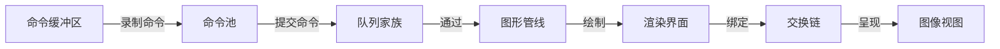

## Vulkan命令缓冲区创建流程（The process of Vulkan CommandBuffer）

回顾上一节中的内容，我们成功创建了Vulkan的图形管线，克服了Vulkan初始化流程中最难的一关。下面本章节我们将深入探讨Vulkan命令缓冲区的创建，这一步也是Vulkan初始化流程中非常重要的一步，它负责将图形的绘制任务录制为命令供Vulkan驱动运行渲染绘制最终的图像。那么接下来就正式进入本章节的内容，学习命令缓冲区的创建。

### 命令缓冲区创建流程
#### 1.创建头文件契约

由于该项目在创建之初就使用了面向对象的编程范式，因而用了大量的类属性和成员函数来组织代码的构造，正是因为OOP的这一特性再加上C++这门语言的特点，就代表着要去头文件中声明属性契约和函数方法契约，最后的定义和实现就需要在源文件中进行。由于以上原因Vulkan初始化流程的第一步一定是要去头文件中声明属性契约，下面就是具体的实现流程：

**HelloTriangleApplication.h**

```cpp
class HelloTriangleApplication
{
private:
    GLFWwindow*                        window          = nullptr;     //窗口属性
    vk::raii::Context                  context;                       //Vulkan上下文
    vk::raii::Instance                 instance        = nullptr;     //Vulkan实例
    vk::raii::DebugUtilsMessengerEXT   debugMessager   = nullptr;     //Vulkan验证层
    vk::raii::PhysicalDevice           physicalDevice  = nullptr;     //物理设备
    vk::raii::Device                   device          = nullptr;     //逻辑设备
    uint32_t                           queueIndex      = ~0;
    vk::raii::Queue                    graphicsQueue   = nullptr;     //图形队列
    vk::raii::SurfaceKHR               surface         = nullptr;     //Vulkan 渲染界面
    vk::raii::SwapchainKHR             swapChain       = nullptr;     //Vulkan 交换链
    vk::SurfaceFormatKHR               swapChainSurfaceFormat;        //渲染界面的格式
    vk::Extent2D                       swapChainExtent;               //交换链的大小
    std::vector<vk::raii::ImageView>   swapChainImageView;            //图像的视图

    vk::raii::PipelineLayout           pipelineLayout   = nullptr;    //图形管线布局
    vk::raii::pipeline                 graphicsPipeline = nullptr;    //图形管线实例对象

    vk::raii::CommandPool              commandPool = nullptr;         //命令池（新添加）
    vk::raii::CommandBuffer            commandBuffer = nullptr;       //命令缓冲区（新添加）
}
```

在项目的头文件私有属性中，我们新添加两个属性契约声明`commandPool`和`commandBuffer`，它们分别负责存储命令和记录命令的调用顺序。同时我们还需要到头文件的私有函数方法区创建两个新的函数方法。具体内容如下展示：

**HelloTriangleApplication.h**

```cpp
class HelloTriangleApplication
{
    void initVulkan();
    void mainLoop();
    void cleanUp();
    void initWindow();
    void CreateInstance();
    
    void setupDebugMessager();
    static VKAPI_ATTP vk::Bool32 VKAPI_CALL debugCallback(
        vk::DebugUtilsMessageSeverityFlagsEXT severity,
        vk::DebugUtilsMessageTypeFlagBitsEXT type,
        const vk::DebugUtilsMessengerCallbackDataEXT* CallbackData,
        void*);

    std::vector<const char*> getRequiredExtensions();
    void pickPhysicalDevice();
    void CreateLogicalDevice();
    void CreateSurface();

    void CreateSwapChain();
    static uint32_t chooseSwapMinImageCount(const vk::SurfaceCapabilitiesKHR& surfaceCapabilities);//选择交换图像的最小数量
    static vk::SurfaceFormatKHR chooseSwapSurfaceFormat(const std::vector<vk::SurfaceFormatKHR>& availableFormats);//选择交换界面的格式
    static vk::PresentModeKHR chooseSwapPresentMode(const std::vector<vk::PresentModeKHR>& availablePresentModes);//选择交换的功能
    vk::Extent2D chooseSwapExtent(const vk::SurfaceCapabilitiesKHR& capabilities);//选择交换的区域范围

    void CreateImageView(); //创建交换链图像的输出格式

    void CreateGraphicsPipeline(); //创建图形管线
    [[nodiscard]] vk::raii::ShaderModule CreateShaderModule(const std::vector<char>& code) const; //创建着色器小程序
    static std::readFile(const std::string& filename); //读取着色器源代码

    void CreateCommandPool();//创建命令池（新添加）
    void CreateCommandBuffer();//创建命令缓冲区（新添加）
}
```

---

#### 2.创建命令池
##### 第一步：创建命令池

由于Vulkan的设计哲学是显示配置所有结构体属性，所以想要创建命令缓冲区，就必须先了解命令池结构体的属性内容，这样才能精准的配置命令缓冲区的特性。下面就是命令池结构体的具体属性内容：

**vk::CommandPoolCreateInfo**

```cpp
struct CommandPoolCreateInfo
{
    static const bool allowDuplcate = false;
    static StructureType structType = StructureType::eCommandPoolCreateInfo;

    vk::CommandPoolCreateFlags flags_            = {};
    uint32_t                   queueFamilyIndex_ = {};
    const void*                pNext_ = nullptr;
}
```

- `flags_`：命令池的创建标志，用于控制命令池和命令缓冲区的行为：
  - `etransient`：提示驱动该池分配的命令缓冲区是短暂使用的，可优化内存分配。
  - `eResetCommandBuffer`：允许单独重置池中的命令缓冲区（否则只能重置整个命令池）。
- `queueFamilyIndex_`：命令池绑定的队列族索引。从该池分配的命令缓冲区，只能提交给属于该队列族的队列执行（例如图形队列族、计算队列族）。
- `pNext_`：扩展指针，用于传递 Vulkan 扩展所需的额外数据。若无扩展使用，保持为 `nullptr` 即可。


**HelloTriangleApplication.cpp**

```cpp
void HelloTriangleApplication::CreateCommandPool()
{
    vk::CommandPoolCreateInfo commandPoolInfo = {
        commandPoolInfo.flags = vk::CommandPoolCreateFlagBits::eResetCommandBuffer;
        commandPoolInfo.queueFamilyIndex = queueIndex,
        commandPoolInfo.pNext = nullptr
    };
}
```

在这里我们设置允许命令缓冲池可以单独重置，同时该命令池使用的图形队列索引为创建图形队列家族时使用图形队列。

**HelloTriangleApplication.cpp**

```cpp
void HelloTriangleApplication::CreateCommandPool() 
{
    //上面代码保持不变

    commandPool = vk::raii::CommandPool(device, commandPoolInfo);
    if(commandPool == nullptr) {
        std::cerr << "Vulkan command pool Create failed!" << std::endl;
        return;
    }
    std::clog << "Vulkan command pool Create success!" << std::endl;
}
```

在这一步最后，我们使用头文件中提前声明创建的属性签名`CommandPool`来存储命令的实例对象。这样命令池就已经创建完成了。


---

##### 第二步：创建命令缓冲区

这个结构体是 Vulkan 中 **从命令池分配命令缓冲区（Command Buffer）** 的核心配置，用来指定分配的来源、类型和数量。下面讲解每一个属性的具体含义：

**vk::CommandBufferAllocateInfo**

```cpp
struct CommandBufferAllocateInfo
{
    static const bool allowDuplicate = false;
    static StructureType structureType = StructureType::eCommandBufferAllocateInfo;

    vk::CommandPool commandPool_ = {};
    vk::CommandBufferLevel level_ = vk::CommandBufferLevel::ePrimary;
    uint32_t commandBufferCount_ = {};
    const void* pNext_ = nullptr;
}
```

- `commandPool_`：命令缓冲区的分配来源，即从哪个命令池分配。该命令池必须与目标队列族绑定，确保分配的缓冲区可以提交到对应队列执行。
- `level_`：命令缓冲区的级别，决定了它的使用场景：
  - `ePrimary`：可以直接提交到队列执行，也可以包含副命令缓冲区，是渲染流程的顶层载体。
  - `eSecondary`：不能直接提交到队列，只能被主命令缓冲区调用，适合复用录制好的指令（如复用的渲染流程、复杂物体绘制指令）。
- `commandBufferCount_`：要分配的命令缓冲区数量，一次可以分配多个，提升批量操作的效率。
- `pNext_`：扩展指针，用于传递 Vulkan 扩展所需的额外数据。若无扩展使用，保持为 `nullptr` 即可。

**HelloTriangleApplication.cpp**

```cpp
void HelloTriangleApplication::CreateCommandBuffer()
{
    vk::CommandBufferAllocateInfo commandBufferInfo = {
        commandBufferInfo.commandPool = commandPool,
        commandBufferInfo.level = vk::CommandBufferLevel::ePrimary,
        commandBufferInfo.commandBufferCount = 1,
        commandBufferInfo.pNext = nullptr
    };
}
```

这里我们将刚刚创建好的命令池分配给命令缓冲区使用，同时允许命令缓冲区直接提交绘制命令到图形队列执行渲染绘制操作，并确保分配的命令缓冲区数量始终为1。

**HelloTriangleApplication.cpp**

```cpp
void HelloTriangleApplication::CreateCommandBuffer()
{
    //上面代码保持不变

    commandBuffer = std::move(vk::raii::CommandBuffers(device, commandBufferInfo).front());
    if(commandBuffer == nullptr) {
        std::cerr << "Vulkan command buffer Create failed!" << std::endl;
        return;
    }
    std::clog << "Vulkan command buffer Create success!" << std::endl;
}
```

这里我们也将之前在头文件中创建的属性签名契约`commandBuffer`来保存命令缓冲区的实例对象，并进行简单的错误检验。

### 创建完成

到这里我们有成功创建了命令缓冲区，有了它就可以录制绘制命令到命令池，命令通过命令池被提交到图形队列家族，队列家族中通过配置好的图形管线把结果渲染绘制到屏幕上，这个就是命令缓冲区的作用。下面通过流程图来展示具体流程：



### 下节预告

下一节中我们将会探讨如何录制命令到命令缓冲区，同时录制一系列的线性变换和仿射变换，这样做离我们最后想要看到的彩色三角形越来越接近了，我相信要不了多久就一定能够实现彩色三角形。