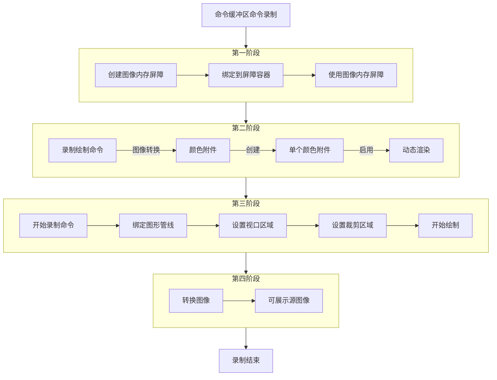

## Vulkan命令录制的流程（The process of Vulkan recordCommandBuffer）

上一章节中我们成功创建了Vulkan的命令池和命令缓冲区，它们能够让编写的录制命令能够成功通过Vulkan驱动最终可视化为屏幕上可见的几何图形。在这一章节中，我们将重点讨论绘制命令的录制，只有我们显示通过录制命令到命令缓冲区才能将想要的图形渲染出来。

### 命令缓冲区的命令录制流程
#### 创建头文件契约

老规矩在正式实现Vulkan任意一个初始化流程之前，我们都必须到头文件中显示声明相关的属性契约，这是项目创建之初就已经决定的特性后面的有关的步骤只能按照特性执行。但这一章节中头文件中不需要声明任何私有属性契约，而是要到私有函数方法区声明相关函数方法。具体的流程如下展示：

**HelloTriangleApplication.h**

```cpp
class HelloTrinagleApplication
{
private:
    void initVulkan();
    void mainLoop();
    void cleanUp();
    void initWindow();
    void CreateInstance();
    
    void setupDebugMessager();
    static VKAPI_ATTP vk::Bool32 VKAPI_CALL debugCallback(
        vk::DebugUtilsMessageSeverityFlagsEXT severity,
        vk::DebugUtilsMessageTypeFlagBitsEXT type,
        const vk::DebugUtilsMessengerCallbackDataEXT* CallbackData,
        void*);

    std::vector<const char*> getRequiredExtensions();
    void pickPhysicalDevice();
    void CreateLogicalDevice();
    void CreateSurface();

    void CreateSwapChain();
    static uint32_t chooseSwapMinImageCount(const vk::SurfaceCapabilitiesKHR& surfaceCapabilities);//选择交换图像的最小数量
    static vk::SurfaceFormatKHR chooseSwapSurfaceFormat(const std::vector<vk::SurfaceFormatKHR>& availableFormats);//选择交换界面的格式
    static vk::PresentModeKHR chooseSwapPresentMode(const std::vector<vk::PresentModeKHR>& availablePresentModes);//选择交换的功能
    vk::Extent2D chooseSwapExtent(const vk::SurfaceCapabilitiesKHR& capabilities);//选择交换的区域范围

    void CreateImageView(); //创建交换链图像的输出格式

    void CreateGraphicsPipeline(); //创建图形管线
    [[nodiscard]] vk::raii::ShaderModule CreateShaderModule(const std::vector<char>& code) const; //创建着色器小程序
    static std::readFile(const std::string& filename); //读取着色器源代码

    void CreateCommandPool();//创建命令池
    void CreateCommandBuffer();//创建命令缓冲区

    void recordCommandBuffer(uint32_t imageIndex); //录制命令到命令缓冲区（新添加）
    void transition_image_Layout(
        uint32_t imageIndex,
        vk::ImageLayout old_layout,
        vk::ImageLayout new_layout,
        vk::AccessFlags2 src_access_mask,
        vk::AccessFlags2 dst_access_mask,
        vk::PipelineStageFlags2 src_stage_mask,
        vk::PipelineStageFlags2 dst_stage_mask,
    ); //图像变换布局（新添加）
}
```

在上面代码片段中我们新添加了两个私有函数方法`recordCommandBuffer()`和`transition_image_layout()`，它们分别负责录制命令缓冲区和记录图像变换的布局，有了这两个私有属性函数方法我们就能正式的记录我们想要的绘制顺序和布局了。

---

#### 2.记录图像变换布局
##### 第一步：创建Vulkan屏障

这里涉及到了Vulkan中的新结构体属性，依照之前的章节规则我们首先得去了解该结构体内部属性含义，这样才能在后续显示配置该结构体阶段保持清晰的头脑思路。下面是该结构体属性内部的属性展示：

**vk::ImageMemoryBarrier2**

```cpp
struct ImageMemoryBarrier2
{
    static const bool allowDuplicate = false;
    static StructureType structureType = StructureType::eImageMemoryBarrier2;

    vk::PipelineStageFlags2 srcStageMask_       = {};
    vk::AccessFlags2        srcAccessMask_      = {};
    vk::PipelineStageFlags2 dstStageMask_       = {};
    vk::AccessFlags2        dstAccessMask_      = {};
    vk::ImageLayout         oldLayout_ = vk::ImageLayout::eUndefined;
    vk::ImageLayout         newLayout_ = vk::ImageLayout::eUndefined;
    uint32_t                srcQueueFamilyIndex = {};
    uint32_t                dstQueueFamilyIndex = {};
    vk::Image               image_              = {};
    vk::ImageSubresourceRange subresourceRange_ = {};
    const void* pNext_ = nullptr;
};
```

这个结构体是 Vulkan 中用于**图像资源的内存屏障（Memory Barrier）**，是实现图像资源在不同管线阶段、不同队列族之间安全同步的核心工具。它是 Vulkan 同步机制的重要组成部分，能保证图像的布局转换和访问权限变更在正确的时机发生。下面是该结构体中每个属性的含义：

- `srcStageMask_`：屏障等待的源管线阶段，表示需要等待这些阶段的所有操作完成后，屏障才会生效。例如，若源阶段是 `VK_PIPELINE_STAGE_2_TRANSFER_BIT`，则等待所有传输操作（如纹理上传）完成。
- `srcAccessMask_`：屏障等待的源访问类型，表示需要等待这些类型的内存访问完成后，屏障才会生效。例如，若源访问是 `VK_ACCESS_2_TRANSFER_WRITE_BIT`，则等待所有对图像的传输写入操作完成。
- `dstStageMask_`：屏障生效后，允许执行的目标管线阶段。例如，若目标阶段是 `VK_PIPELINE_STAGE_2_FRAGMENT_SHADER_BIT`，则屏障生效后，片元着色器可以访问该图像。
- `dstAccessMask_`：屏障生效后，允许执行的目标访问类型。例如，若目标访问是 `VK_ACCESS_2_SHADER_READ_BIT`，则屏障生效后，着色器可以读取该图像。
- `oldLayout_`：图像在屏障生效前的旧布局，即当前图像所处的布局。常见值：`eUndefined`（未定义）、`eTransferDstOptimal`（传输目标最优）、`eShaderReadOnlyOptimal`（着色器读取最优）。
- `newLayout_`：图像在屏障生效后的新布局，即希望图像转换到的布局。布局转换是该屏障的核心功能之一，例如从 `eTransferDstOptimal` 转换到 `eShaderReadOnlyOptimal`，以支持着色器采样。
- `srcQueueFamilyIndex_`：源队列族索引，仅在跨队列族传输图像时需要设置。若不需要跨队列传输，设为 `VK_QUEUE_FAMILY_IGNORED`。
- `dstQueueFamilyIndex_`：目标队列族索引，仅在跨队列族传输图像时需要设置。若不需要跨队列传输，设为 `VK_QUEUE_FAMILY_IGNORED`。
- `image_`：需要同步和转换布局的图像资源句柄。
- `subresourceRange_`：需要同步的图像子资源范围，定义了屏障作用于图像的哪些部分（如 mipmap 层级、数组层、颜色 / 深度 / 模板通道）。
- `pNext_`：扩展指针，用于传递 Vulkan 扩展所需的额外数据。若无扩展使用，保持为 `nullptr` 即可。

**HelloTriangleApplication.cpp**

```cpp
void HelloTriangleApplication::transition_image_layout(
    uint32_t imageIndex, 
    vk::ImageLayout old_layout, 
    vk::ImageLayout new_layout, 
    vk::AccessFlags2 src_access_mask, 
    vk::AccessFlags2 dst_access_mask, 
    vk::PipelineStageFlags2 src_stage_mask, vk::PipelineStageFlags2 dst_stage_mask
)
{
    vk::ImageMemoryBarrier2 barrier = {
        barrier.srcStageMask = src_stage_mask,
        barrier.srcAccessMask = src_access_mask,
        barrier.dstStageMask = dst_stage_mask,
        barrier.dstAccessMask = dst_access_mask,
        barrier.oldLayout = old_layout,
        barrier.newLayout = new_layout,
        barrier.srcQueueFamilyIndex = VK_QUEUE_FAMILY_IGNORED,
        barrier.dstQueueFamilyIndex = VK_QUEUE_FAMILY_IGNORED,
        barrier.image = swapChainImages[imageIndex],
        barrier.subresourceRange = {
            barrier.subresourceRange.aspectMask = vk::ImageAspectFlagBits::eColor;
            barrier.subresourceRange.baseMipLevel = 0,
            barrier.subresourceRange.levelCount = 1,
            barrier.subresourceRange.baseArrayLayer = 0,
            barrier.subresourceRange.layerCount = 1
        },
        barrier.pNext = nullptr
    };
} 
```

---

##### 第二步：创建依赖关系

这个结构体是 Vulkan 同步机制的**统一容器**，用来在单个同步操作中批量提交多种类型的内存屏障（Memory Barrier），是 Vulkan 2.0 及以后版本中实现高效同步的核心工具。它的具体结构体属性含义如下展示：

**vk::DependencyInfo**

```cpp
struct DependencyInfo
{
    static const bool allowDuplicate = false;
    static StructureType structureType = StructureType::eDependencyInfo;

    vk::DependencyFlags             dependencyFlags_          = {};
    uint32_t                        memoryBarrierCount_       = {};
    const vk::MemoryBarrier2*       pMemoryBarriers_          = {};
    uint32_t                        bufferMemoryBarrierCount_ = {};
    const vk::BufferMemoryBarrier2* pBufferMemoryBarriers_    = {};
    uint32_t                        imageMemoryBarrierCount_  = {};
    const vk::ImageMemoryBarrier2*  pImageMemoryBarriers_     = {};
    const void* pNext_ = nullptr;
};
```

- `dependencyFlags_`：依赖关系的全局标志，用于控制屏障的同步范围和行为：
  - `eByRegion`：按区域同步，仅同步资源的被访问区域，而非整个资源，可提升并行性能。
  - `eViewLocal`：仅同步当前视图的资源，适合多视图渲染场景。
- `memoryBarrierCount_`：通用内存屏障的数量，必须与 `pMemoryBarriers_` 数组的长度一致。
- `pMemoryBarriers_`：指向通用内存屏障数组的指针，用于同步对通用设备内存的访问（如缓冲区的读写同步）。
- `bufferMemoryBarrierCount_`：缓冲区内存屏障的数量，必须与 `pBufferMemoryBarriers_` 数组的长度一致。
- `pBufferMemoryBarriers_`：指向缓冲区内存屏障数组的指针，用于同步对缓冲区资源的访问（如顶点缓冲区、索引缓冲区的读写同步）。
- `ImageMemoryBarrierCount_`：图像内存屏障的数量，必须与 `pImageMemoryBarriers_` 数组的长度一致。
- `pImageMemoryBarriers_`：指向图像内存屏障数组的指针，用于同步对图像资源的访问和布局转换（如纹理、帧缓冲附件的同步）。
- `pNext_`：扩展指针，用于传递 Vulkan 扩展所需的额外数据（如 `VkDependencyInfoEXT`等扩展结构）。

**HelloTriangleApplication.cpp**

```cpp
void HelloTriangleApplication::transition_image_layout(
    uint32_t imageIndex, 
    vk::ImageLayout old_layout, 
    vk::ImageLayout new_layout, 
    vk::AccessFlags2 src_access_mask, 
    vk::AccessFlags2 dst_access_mask, 
    vk::PipelineStageFlags2 src_stage_mask, vk::PipelineStageFlags2 dst_stage_mask
)
{
    //上面代码保持不变

    vk::DependencyInfo dependencyInfo = {
        dependencyInfo.dependencyFlgas = {};
        dependencyInfo.memoryBarrierCount = 0;
        dependencyInfo.pMemoryBarriers = nullptr,
        dependencyInfo.bufferMemoryBarrierCount = 0,
        dependencyInfo.pBufferMemoryBarriers = nullptr,
        dependencyInfo.imageMemoryBarrierCount = 1,
        dependencyInfo.pImageMemoryBarriers = &barrier,
        dependencyInfo.pNext = nullptr
    };

    commandBuffer.pipelineBarrier2(dependencyInfo);
}
```

在上面代码中，我们显示创建了Vulkan屏障机制的统一容器`vk::DependencyInfo`结构体，由于该项目只用于图像渲染，所以这里仅仅只设置了图像内存屏障，暂时丢弃内存屏障和缓冲区内存屏障。并在最后将该屏障的统一容器绑定到命令缓冲区。

---

#### 3.录制命令缓冲区命令
##### 第一步：录制准备

当我们创建好Vulkan图像屏障后，就可以正式开始为命令缓冲区录制绘制命令了，这一步将会在之前头文件创建的私有属性方法`recordCommandBuffer()`函数中实现命令的录制。以下是录制绘制命令的准备阶段：

**HelloTriangleApplcation.cpp**

```cpp
void HelloTriangleApplication::recordCommandBuffer(uint32_t imageIndex)
{
    commandBuffer.begin({});

    transition_iamge_layout(
        imageIndex,
        vk::ImageLayout::eUndefined,
        vk::ImageLayout::eColorAttachmentOptimal,
        {},
        vk::AccessFlagBits::eColorAttachmentWrite,
        vk::PipelineStageFlagBits2::eColorAttachmentOutput,
        vk::PipelineStageFlagBits2::eColorAttachmentOutput
    );
    vk::ColorValue clearValue = vk::ClearColorValue(0.0f, 0.0f, 0.0f, 1.0f);
}
```

在上面这一段代码中一开头就开启了使用默认模式录制命令缓冲区，然后对图像布局进行转换这里从`Undefined`未定义转换为`eColorAttachmentOptimal`颜色附件最优。之后再使用`vk::ColorValue`将背景颜色设置为纯黑色。

---

##### 第二步：创建单个动态渲染附件信息

这个结构体是 Vulkan 动态渲染（Dynamic Rendering） 模式的核心配置，用于描述单个渲染附件（颜色、深度、模板）的属性和操作规则，替代了传统渲染通道（RenderPass）中的附件描述。在 Vulkan 动态渲染模式下，不再需要提前创建 `RenderPass` 和 `Framebuffer`，而是通过该结构体直接定义渲染时使用的附件：

**vk::RenderingAttachmentInfo**

```cpp
struct RenderingAttachmentInfo
{
    static const bool allowDupelicate = false;
    static StructureType structureType = StructureType::eRenderingAttachmentInfo;

    vk::ImageView           imageView_ = {};
    vk::ImageLayout         imageLayout_ = vk::ImageLayout::eUndefined,
    vk::ResolveModeFlagBits resolveMode_ = vk::ResolveModeFlagBits::eNone;
    vk::ImageView           resolveImageView_ = {};
    vk::ImageLayout         resolveImageLayout = vk::ImageLayout::eUndefined,
    vk::AttachmentLoadOp    loadOp_ = vk::AttachmentLoadOp::eLoad;
    vk::AttachmentLoadOp    storeOp_ = vk::AttachmentLoadOp::eStore;
    vk::ClearValue          clearValue_ = {};
    const void* pNext_ = nullptr;
}
```

- `imageView_`：要绑定的图像视图，作为渲染的目标附件（颜色 / 深度 / 模板缓冲）例如，交换链图像的视图通常作为颜色附件。
- `imageLayout_`：渲染期间附件图像的布局，必须与图像当前的布局一致，通常为：
  - `eColorAttachmentOptimal`：颜色附件的最优布局。
  - `eDepthStencilAttachmentOptimal`：深度 / 模板附件的最优布局。
- `resolveMode_`：多重采样解析模式，仅在附件使用 MSAA 时需要设置：
  - `eNone`（默认）：不执行解析。
  - `eAverag`/`eMin`/`eMax`：将 MSAA 采样结果解析为单采样图像。
- `resolveImageView_`：解析目标的图像视图，仅在 `resolveMode_ != eNone` 时有效，用于接收 MSAA 解析后的结果。
- `resolveImageLayout_`：解析目标图像的布局，通常为 `eShaderReadOnlyOptimal`，以便后续着色器采样。
- `loadOp_`：渲染前对附件的加载操作：
  - `eLoad`：保留附件中的原有数据。
  - `eClear`：清除附件数据（使用 `clearValue_`中的值）。
  - `eDontCare`：不关心原有数据，驱动可直接覆盖。
- `storeOp_`：渲染后对附件的存储操作：
  - `eStore`：保留渲染后的结果（用于后续显示或采样）
  - `eDontCare`：丢弃结果，不保留到内存。
- `clearValue`：当 `loadOp_ = eClear` 时生效，指定清除附件时使用的值：
  - 颜色附件：`vk::ClearColorValue`（RGBA）
  - 深度 / 模板附件：`vk::ClearDepthStencilValue`
- `pNext_`：扩展指针，用于传递 Vulkan 扩展所需的额外数据。若无扩展使用，保持为 `nullptr` 即可。

**HelloTriangleApplication.cpp**

```cpp
void HelloTriangleApplication::recordCommandBuffer(uint32_t imageIndex)
{
    //上面代码保持不变

    vk::RenderingAttachmentInfo attachmentInfo = {
        attachmentInfo.imageView = swapChainImageView[imageIndex],
        attachmentInfo.imageLayout = vk::ImageLayout::eColorAttachmentOptimal,
        attachmentInfo.resolveMode = vk::ResolveModeFlagBits::eNone;
        attachmentInfo.resolveImageView = nullptr,
        attachmentInfo.resolveImageLayout = vk::ImageLayout::eUndefined,
        attachmentInfo.loadOp = vk::AttachmentLoadOp::eClear,
        attachmentInfo.storeOp = vk::AttachmentStoreOp::eStore,
        attachmentInfo.clearValue = clearColor,
        attachmentInfo.pNext = nullptr
    };
}
```

上面代码就是对动态渲染结构体的显示属性配置，这个结构体配置的大概含义是：该单一动态渲染附件绑定的是交换链图像容器中图像，该动态渲染附件不使用MSAA，同时不解析MSAA图像的图像布局，并且每一帧绘制图像并每一帧清除图像至背景色。

---

##### 第四步：创建整个动态渲染信息

这个结构体是 Vulkan **动态渲染（Dynamic Rendering）** 模式的全局配置入口，用来聚合所有渲染附件和全局渲染参数，是 vkCmdBeginRendering 函数的核心入参。具体的属性含义如下展示：

**vk::RenderingInfo**

```cpp
struct RenderingInfo
{
    static const bool allowDuplicate = false;
    static StructureType structureType = StructureType::eRenderingInfo;

    vk::RnederingFlags                 flags_ = {};
    vk::Rect2D                         renderArea_ = {};
    uint32_t                           layerCount_ = {};
    uint32_t                           viewMask_ = {};
    uint32_t                           colorAttachmentCount_ = {};
    const vk::RenderingAttachmentInfo* pColorAttachments_ = {};
    const vk::RenderingAttachmentInfo* pDepthAttachment_ = {};
    const vk::RenderingAttachmentInfo* pStencilAttachment_ = {};
    const void* pNext_ = nullptr;
}
```

- `flags_`：渲染的全局标志位，目前 Vulkan 规范中没有定义可用标志，通常初始化为空。
- `renderArea_`：渲染区域，定义了本次渲染的矩形范围（偏移和尺寸），只有该区域内的像素会被渲染。通常设置为与交换链分辨率一致，实现全屏渲染。
- `layerCount_`：渲染的图像层数，用于数组纹理或 3D 纹理，2D 图像默认设为 `1`。
- `viewMask_`：多视图渲染的视图掩码，用于 VR 等需要同时渲染多个视图的场景，默认设为 `0`（关闭多视图）。
- `colorAttachmentCount_`：颜色附件的数量，必须与 `pColorAttachments_` 数组的长度一致。
- `pColorAttachments_`：指向颜色附件配置数组的指针，每个元素对应一个颜色附件的 `RenderingAttachmentInfo`。
- `pDepthAttachment_`：深度附件的配置，若不需要深度测试则设为 `nullptr`。
- `pStencilAttachment_`：模板附件的配置，若不需要模板测试则设为 `nullptr`。
- `pNext_`：扩展指针，用于传递 Vulkan 扩展所需的额外数据，若无扩展使用则保持为 `nullptr`。

**HelloTriangleApplication.cpp**

```cpp
void HelloTriangleApplication::recordCommandBuffer(uint32_t imageIndex)
{
    //上面代码保持不变

    vk::RenderingInfo renderingInfo = {
        renderingInfo.flags = {},
        renderingInfo.renderArea = {
            renderingInfo.renderArea.offset.x = 0,
            renderingInfo.renderArea.offset.y = 0,
            renderingInfo.renderArea.extent = swapChainExtent
        },
        renderingInfo.layerCount = 1,
        renderingInfo.viewMask = 0,
        renderingInfo.colorAttachmentCount = 1,
        renderingInfo.pColorAttachments = &attachmentInfo,
        renderingInfo.pDepthAttachment = nullptr,
        renderingInfo.pStencilAttachment = nullptr,
        renderingInfo.pNext = nullptr
    };
}
```

上面的代码是动态结构体的显示属性配置，该结构体的含义是：动态渲染没有x轴和y轴上的偏移量，总的渲染区域大小是配置Vulkan交换链的交换区域大小，同时我们需要颜色附件，所以我们设置动态渲染颜色附件数量为1，具体的颜色附件对象是之前的单一颜色附件。


---

##### 第五步：录制绘制命令

前面我们设置好了图像动态渲染需要的单一颜色附件和动态渲染需要的配置，接下来就要正式开始录制绘制命令了，只有录制了图像的绘制命令最后的Vulkan驱动才会运行相关设备，最终将完整的图像渲染到屏幕上。

**HelloTriangleApplication.cpp**

```cpp
void HelloTriangleApplication::recordCommandBuffer(uint32_t imageIndex)
{
    //上面的代码保持不变

    commandBuffer.beginRendering(renderingInfo);
    commandBuffer.bindPipeline(vk::PipelineBindPoint::eGraphics, *graphicsPipeline);
    commandBuffer.setViewport(0, vk::viewport(0.0f, 0.0f, 
        static_cast<float>(swapChainExtent.width), 
        static_cast<float>(swapChainExtent.height), 
        0.0f, 1.0f));
    commandBuffer.setScissor(0, vk::Rect2D(vk::Offset2D(0, 0), swapChainExtent));
    commandBuffer.draw(3, 1, 0, 0);
    commandBuffer.endRendering();

    transition_image_layout(
        imageIndex,
        vk::ImageLayout::eColorAttachmentOptimal,
        vk::ImageLayout::ePresentSrcKHR,
        vk::ImageLayout::eColorAttachmentWrite,
        {},
        vk::PipelineStageFlagBits2::eColorAttachmentOutput,
        vk::PipelineStageFlagBits2::eBottomOfPipe
    );
    commandBuffer.end();
}
```

上面这段代码中使用了之前创建好的动态渲染特性开始录制命令，同时将之前配置好的图形管线绑定到该命令缓冲区，与此同时设置视口大小适配交换链的大小，原点坐标保持不变于窗口匹配；裁剪视口也和交换链区域的大小相同。最后再一次调用图像的转换方法，将颜色附件转换为可以展示的源图像。

---

### 创建成功



上面的流程图展示的是该章节的步骤梳理图，从第一阶段的创建图形屏障和屏障容器；再到第二阶段将未定义的图像转换为动态渲染的颜色附件，创建单一颜色附件绑定到具体的动态渲染的实例对象；之后的第三阶段开始正式录制命令，从绑定图形管线开始到设置视口和裁剪区域配置再到显示调用`draw()`函数方法绘制命令；第四阶段再次将图像从颜色附件转换为可展示的源图像后，最终结束命令录制。


### 下节预告

在下一章节中，我们心心念念的用Vulkan绘制的彩色三角形将会变为现实，届时将深入探讨Vulkan的同步指令的创建流程，这里值得一提的是Vulkan的同步指令有多个结构体环节构成，包括：信号量、栅栏和命令提交。当然你只需接的现阶段我们虽然录制了绘制命令，但是这正考试是写的解题步骤，你目前还在答题阶段，你还未将完整的试卷交给老师阅卷，你当然考不到最终得分结果，这里情况一致，只有显示提交录制的命令才能在最后渲染结果。所以现在就可再心里期待一下了。