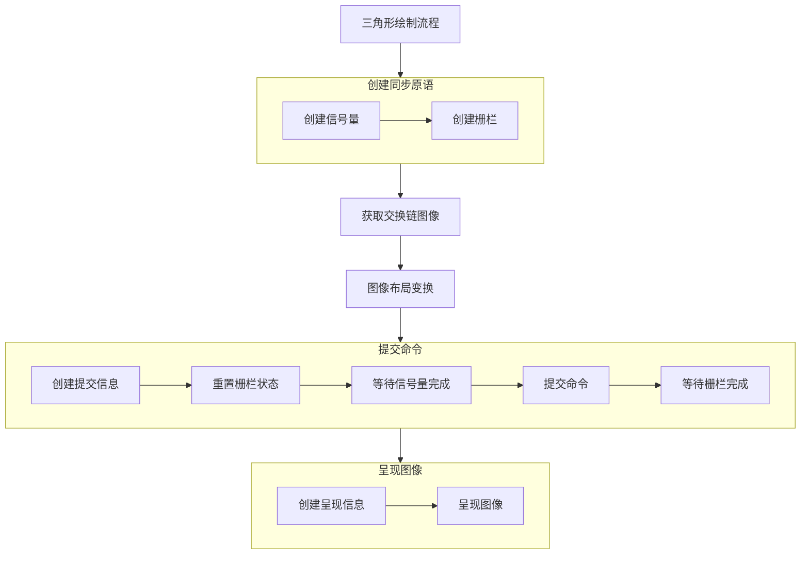

## Vulkan绘制彩色三角形流程（The process of Vulkan drawColorTriangle）

上一章节中我们创建了为Vulkan项目录制了命令到命令缓冲区，其中使用到了屏障（Barrier）、单个动态渲染的颜色附件以及启用了动态渲染特性，这样做摆脱了传统的Renderpass + Framebuffer的固定的Vulkan管线，得以在设置管线的时候可以灵活切换，而不用从头再来完整配置另一个渲染管线。下面这一章节中我们将执行该项目的最后一步，创建信号量和栅栏并提交命令缓冲区录制的绘制命令，让Vulkan驱动能够根据命令缓冲区的命令将最后的彩色三角形渲染到屏幕中来。接下来我们就开始本章节的内容学习。

### 彩色三角形绘制流程
#### 创建头文件契约

在每个章节的开头都要去头文件中创建该章节需要使用到的Vulkan属性，这是一直以来约定俗成的隐式规则，本章节同样也不会例外，首先我们需要到头文件中创建该章节需要用到属性和函数方法，当然既然我们需要用到信号量（Semaphore）和栅栏（Fence），那就需要声明相关的属性契约，同时还要创建两个函数分别用于信号量和栅栏的创建以及提交绘制命令。具体流程如下展示：

**HelloTriangleApplication.h**

```cpp
class HelloTriangleApplication
{
private:
    GLFWwindow*                        window          = nullptr;     //窗口属性
    vk::raii::Context                  context;                       //Vulkan上下文
    vk::raii::Instance                 instance        = nullptr;     //Vulkan实例
    vk::raii::DebugUtilsMessengerEXT   debugMessager   = nullptr;     //Vulkan验证层
    vk::raii::PhysicalDevice           physicalDevice  = nullptr;     //物理设备
    vk::raii::Device                   device          = nullptr;     //逻辑设备
    uint32_t                           queueIndex      = ~0;
    vk::raii::Queue                    graphicsQueue   = nullptr;     //图形队列
    vk::raii::SurfaceKHR               surface         = nullptr;     //Vulkan 渲染界面
    vk::raii::SwapchainKHR             swapChain       = nullptr;     //Vulkan 交换链
    vk::SurfaceFormatKHR               swapChainSurfaceFormat;        //渲染界面的格式
    vk::Extent2D                       swapChainExtent;               //交换链的大小
    std::vector<vk::raii::ImageView>   swapChainImageView;            //图像的视图

    vk::raii::PipelineLayout           pipelineLayout   = nullptr;    //图形管线布局
    vk::raii::pipeline                 graphicsPipeline = nullptr;    //图形管线实例对象

    vk::raii::CommandPool              commandPool = nullptr;         //命令池
    vk::raii::CommandBuffer            commandBuffer = nullptr;       //命令缓冲区

    vk::raii::Semaphore              presentCompleteSemaphore = nullptr; //呈现完整信号量（新添加）
    vk::raii::Semaphore              renderFinishedSemaphore = nullptr;  //渲染完整的信号量（新添加）
    vk::raii::Fence                    drawFence         = nullptr;      //栅栏
}
```

```cpp
class HelloTriangleApplication
{
    private:
    void initVulkan();
    void mainLoop();
    void cleanUp();
    void initWindow();
    void CreateInstance();
    
    void setupDebugMessager();
    static VKAPI_ATTP vk::Bool32 VKAPI_CALL debugCallback(
        vk::DebugUtilsMessageSeverityFlagsEXT severity,
        vk::DebugUtilsMessageTypeFlagBitsEXT type,
        const vk::DebugUtilsMessengerCallbackDataEXT* CallbackData,
        void*);

    std::vector<const char*> getRequiredExtensions();
    void pickPhysicalDevice();
    void CreateLogicalDevice();
    void CreateSurface();

    void CreateSwapChain();
    static uint32_t chooseSwapMinImageCount(const vk::SurfaceCapabilitiesKHR& surfaceCapabilities);//选择交换图像的最小数量
    static vk::SurfaceFormatKHR chooseSwapSurfaceFormat(const std::vector<vk::SurfaceFormatKHR>& availableFormats);//选择交换界面的格式
    static vk::PresentModeKHR chooseSwapPresentMode(const std::vector<vk::PresentModeKHR>& availablePresentModes);//选择交换的功能
    vk::Extent2D chooseSwapExtent(const vk::SurfaceCapabilitiesKHR& capabilities);//选择交换的区域范围

    void CreateImageView(); //创建交换链图像的输出格式

    void CreateGraphicsPipeline(); //创建图形管线
    [[nodiscard]] vk::raii::ShaderModule CreateShaderModule(const std::vector<char>& code) const; //创建着色器小程序
    static std::readFile(const std::string& filename); //读取着色器源代码

    void CreateCommandPool();//创建命令池
    void CreateCommandBuffer();//创建命令缓冲区

    void recordCommandBuffer(uint32_t imageIndex); //录制命令到命令缓冲区（新添加）
    void transition_image_Layout(
        uint32_t imageIndex,
        vk::ImageLayout old_layout,
        vk::ImageLayout new_layout,
        vk::AccessFlags2 src_access_mask,
        vk::AccessFlags2 dst_access_mask,
        vk::PipelineStageFlags2 src_stage_mask,
        vk::PipelineStageFlags2 dst_stage_mask,
    ); //图像变换布局（新添加）

    void CreateSyncObjects(); //创建同步对象（新添加）
    void DrawFrame();         //绘制图像帧（新添加）
}
```

#### 彩色三角形绘制流程
##### 第一步：创建信号量与栅栏

###### 创建信号量

在绘制彩色三角形之前我们需要先干的第一件事情创建信号量，这里将这里的信号量类比为C++多线程中的条件变量。还需要做的事情是要先去了解信号量结构体的内部属性，但是正如下面所展示的结构体一样，Vulkan信号量结构体的属性很少只有两个，这可能是我们见过的属性最少的Vulkan结构体了。

**vk::SemaphoreCreateInfo**

```cpp
struct SemaphoreCreateInfo
{
    static const bool allowDupelicate = false;
    static StructureType structureType = StructureType::eSemaphoreCreateInfo;

    vk::SemaphoreCreateFlags flags_ = {};
    const void* pNext_ = nullptr;
}
```

**HelloTriangleApplication.cpp**

```cpp
void HelloTriangleApplication::CreateSyncObjects()
{
    presentCompleteSemaphore = vk::raii::Semaphore(device, vk::SemaphoreCreateInfo());
    renderFinishedSemaphore = vk::raii::Semaphore(device, vk::SemaphoreCreateInfo());
}
```

在上面这段代码中，我们创建了两个信号量`presentCompleteSemaphore`和`renderFinishedSemaphore`用于呈现渲染结果时同步和渲染期间同步。

---

###### 创建栅栏

再把信号量创建完成之后，就可以开始创建栅栏了，值得说明的是：Vulkan本身所有的操作都是在GPU上完成的，但绝大多数情况是CPU作为主机来控制整个程序，GPU则用来处理计算密集型的任务，这个分工十分重要。而这里的栅栏就是CPU与GPU之间数据互通的重要结构，没有它CPU和GPU会各自为战，这会让Vulkan的高性能一无是处。下面是栅栏结构体的具体配置

**vk::FenceCreateInfo**

```cpp
struct FenceCreateInfo
{
    static const bool allowDuplicate = false;
    static StructureType structType = StructureType::eFenceCreateInfo;

    vk::FenceCreateFlags flags_ = {};
    const void* pNext_ = nullptr;
}
```

**HelloTriangleApplication.cpp**

```cpp
void HelloTriangleApplication::CreateSyncObjects()
{
    //上面代码保持不变

    vk::FenceCreateInfo fenceInfo = {
        fenceInfo.flags = {},
        fenceInfo.pNext = nullptr
    };
}
```

这里我们创建了Vulkan的栅栏实例对象，以便后续使用。

---

##### 第二步：保存栅栏实例对象

这一步我们将会把前一步创建的栅栏用成员属性来保存对象。下面是具体的步骤展示：

**HelloTriangleApplication.cpp**

```cpp
void HelloTriangleApplication::CreateSyncObjects()
{
    //上面代码保持不变

    drawFence = vk::raii::Fence(device, fenceInfo);
    if(drawFence == nullptr) {
        std::clog << "Vulkan fence Create failed!" << std::endl;
        return;
    }
    std::clog << "Vulkan fence Create success!" << std::endl;
}
```


---

##### 第三步：绘制单帧图像

**HelloTriangleApplication.cpp**

```cpp
void HelloTriangleApplication::DrawFrame()
{
    graphicsQueue.waitIdle();

    auto [result, imageIndex] = swapChain.acquireNextImage(UINT64_MAX, *presentCompleteSemaphore, nullptr);
    if(reslut != vk::Result::eSuccess && result != vk::Result::eSuboptimalKHR) {
        throw std::runtime_error("Failed to swap chain image!");
    }
    recordCommandBuffer(iamgeIndex);
}
```

这段代码是绘制函数的第一阶段，表示图形队列等待到空闲阶段，从交换链中获取下一帧图像，其中的参数表示为：

- `UINT64_MAX`：表示等待无限长的时间，直到上一帧输出完成后才获取新渲染的图像。
- `*presentCompleteSemaphore`：等待的信号量，该信号量会在「交换链图像准备就绪（可被渲染写入）」时被触发（信号量置为已触发状态），用于后续同步命令缓冲区的提交。
- `nullptr`：无需指定栅栏（Fence），此处用信号量即可满足同步需求。

同时判断图像获取的结果，如果得到的结果不是成功或者次优的话，就抛出运行时异常。接着就执行提前录制好的命令缓冲区命令。

---

这里我们还是先选择去理解一下Vulkan命令提交结构体的内部属性，这样会让我们的理解程度更上一层楼。具体的内部属性如下：

**vk::SubmitInfo**

```cpp
struct SubmitInfo
{
    static const bool allowDuplicate = false;
    static StructureType structureType = StructureType::eSubmitInfo;

    uint32_t                      waitSemaphoreCount_   = {};
    const vk::Semaphore*          pWaitSemaphores_      = {};
    const vk::PipelineStageFlags* pWaitDstStageMask_    = {};
    uint32_t                      commandBufferCount_   = {};
    const vk::CommandBuffer*      pCommandBuffers_      = {};
    uint32_t                      signalSemaphoreCount_ = {};
    const vk::Semaphore*          pSignalSemaphores_    = {};
    const void* pNext_ = nullptr;
}
```

- `waitSemaphoreCount_`：用于GPU队列中的信号量同步指令的数量，该数量必须与`pWaitSemaohores_`数组的元素数量相同。
- `pWaitSemaphores_`：指向信号量数组内存地址的指针。
- `pWaitDstStageMask_`：等待的目标管线阶段：表示要等待信号量触发后，才能执行「颜色附件输出阶段」及后续的 GPU 管线操作（即绘制指令中向颜色附件写入的操作），精准控制同步时机。
- `commandBufferCount_`：提交命令缓冲区的数量，必须与`pCommandBuffers_`数组的元素数量相同。
- `pCommandBuffers_`：指向提交的命令缓冲区数组内存地址的指针。
- `signalSemaphoreCount_`：指令执行完成后要触发的信号数量，必须与`pSignalSemaphores_`数组的元素数量相同。
- `pSignalSemaphores_`：指向触发的信号量数组内存地址的指针，用于后续同步屏幕的展示操作。
- `nullptr_`：无扩展，使用`nullptr`即可。

**HelloTriangleApplication.cpp**

```cpp
void HelloTriangleApplication::DrawFrame()
{
    device.resetFence(*drawFence);
    vk::PipelineStageFlags waitDestinationStageMask(vk::PipelineStageFlagBits::eColorAttachmentOutput);
    vk::SubmitInfo submitInfo = {
        submitInfo.waitSemaphoreCount = 1,
        submitInfo.pWaitSemaphores = &*presentCompleteSemaphore,
        submitInfo.commandBufferCount = 1,
        submitInfo.pCommandBuffers = &*commandBuffer,
        submitInfo.signalSemaphore = 1,
        submitInfo.pSignalSemaphores = &*renderFinishedSemaphore,
        submitInfo.pNext = nullptr
    };
}
```

---


**HelloTriangleApplication.cpp**

```cpp
void HelloTriangleApplication::DrawFrame()
{
    graphicsQueue.submit(submitInfo, *drawFence);
    result = device.waitForFence(*drawFence, vk::True, UINT64_MAX);
    if(result != vk::Result::eSuccess) {
        throw std::runtime_error("Failed to wait for fence!");
    }
}
```

在这段代码中图像队列提交了命令缓冲区的命令，这是一个异步执行操作，后面CPU等待该异步操作的栅栏信号通知，最后检查结果状态，如果状态显示为成功就抛出异常。

---

这一步操作就是队列呈现结构体的配置，我们仍然需要先了解该结构体的内部属性，才能正确的配置该结构体。该结构体内部属性如下展示：

**vk::PresentInfoKHR**

```cpp
struct PresentInfoKHR
{
    static const bool allowDuplicate = false;
    static StructureType structureType = StructureType::ePresentInfoKHR;

    uint32_t                waitSemaphoreCount_ = {};
    const vk::Semaphore*    pWaitSemaphores_    = {};
    uint32_t                swapchainCount_     = {};
    const vk::SwapchainKHR* pSwapchains_        = {};
    const uint32_t*         pImageIndices_      = {};
    vk::Result*             pResults_           = {};
    const void*             pNext_              = {};
}
```

- `waitSemaphoreCount_`：等待的信号量数量，必须与`pWaitSemaphores_`数组的元素个数相同。
- `pWaitSemaphores_`：指向等待信号量数组内存地址的指针。
- `swapchainCount_`：要使用的交换链数量，必须与`pSwapchains_`数组的元素数量相同。
- `pSwapchains_`：指向使用的交换链数组内存地址的指针。
- `pImageIndices_`：要展示的交换链图像索引。
- `pResult_`：获取每个交换链的结果。
- `pNext_`：扩展属性指针，当前没有扩展属性的结构体，设置为`nullptr`即可。

**HelloTriangleApplication.cpp**

```cpp
void HelloTriangleApplication::DrawFrame()
{
    vk::PresentInfoKHR presentInfoKHR = {
        presentInfoKHR.waitSemaphoreCount = 1,
        presentInfoKHR.pWaitSemaphores = &*renderFinishedSemaphore,
        presentInfoKHR.swapchainCount = 1,
        presentInfoKHR.pSwapchains = &*swapChain
        presentInfoKHR.pImageIndices = &imageIndex,
        presentInfoKHR.pResult = nullptr,
        presentInfoKHR.pNext = nullptr
    };
    result = graphicsQueue.presentKHR(presentInfoKHR);
    switch (result)
    {
    case vk::Result::eSuccess:
        break;
    case vk::Resilt::eSuboptimalKHR:
        std::cout << "vk::GraphicsQueue::presentKHR returned vk::Result::eSuboptimalKHR!" << std::endl;
        break;
    default:
        break;
    }
}
```

---

### 绘制完成



上面流程图展示的是本章节中的核心内容，从创建同步原语到获取交换链图像再到图像的布局变换，后面紧接着就是最关键的命令提交阶段，这一阶段需要大量的使用同步原语，最后呈现图像之前在统一等待栅栏的完成之后就是完整的图像呈现。

---